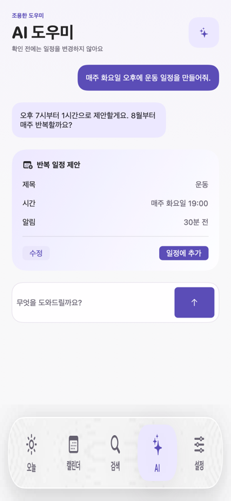
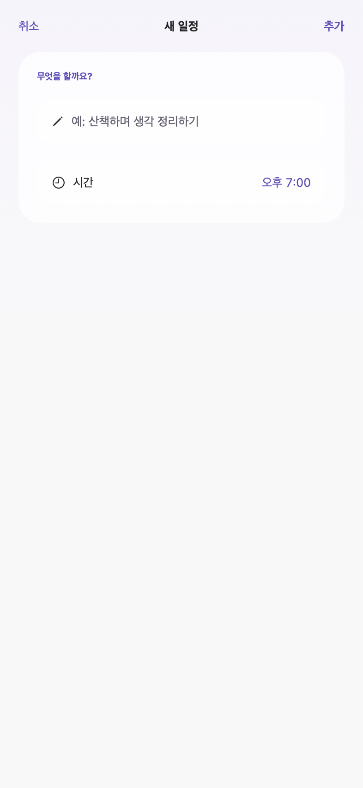

# Memdo

AI 일정 제안, 개인 캘린더, 하루 요약, 홈·잠금화면 위젯을 결합한 iOS 앱입니다.

## 화면

|                                        |                                          |                                       |
| -------------------------------------- | ---------------------------------------- | ------------------------------------- |
|  |  |  |
| Today                                  | Calendar                                 | Assistant                             |
|  |  |  |
| 새 일정                                | 홈·잠금화면 위젯                          | 오늘의 브리핑                          |

나머지 화면은 [`design/previews`](design/previews)에 전체 시안으로 보관합니다.

## Tech Stack

- **UI**: SwiftUI, Swift 6, iOS 17+ (`apps/ios/Memdo/project.yml`)
- **프로젝트 생성**: [XcodeGen](https://github.com/yonaskolb/XcodeGen) — `project.yml`에서
  `Memdo.xcodeproj`를 생성한다 (생성된 `.xcodeproj`도 커밋함 — 아래 "iOS 프로젝트" 참고)
- **백엔드 연동**: [`supabase-swift`](https://github.com/supabase/supabase-swift) (Auth, 익명 세션),
  YAML 파싱은 [`Yams`](https://github.com/jpsim/Yams)
- **AI**: 온디바이스 Apple FoundationModels + 사용자 BYOK OpenRouter(클라우드, streaming)
- **위젯/Live Activity**: WidgetKit, ActivityKit (Dynamic Island)
- **오프라인**: 로컬 outbox 큐 + 재연결 시 자동 재전송
- **백엔드 저장소**: [`../memdo-backend`](../memdo-backend) (Supabase Edge Functions, 별도 독립
  git 저장소)

## 현재 상태

2026-08-17 시점에 계획된 개발 범위(B0~B11)를 한 번 마쳤고, 이후 세 차례 재개됐다 — Agent 견고성·평가
체계(2026-08-21~09-01, 47 PR), Google Calendar 양방향 동기화(2026-09-02), 보안/신뢰성 리뷰 + 배포
인프라 복구(2026-09-07~09). 재개 이력의 자세한 내용은
[`../memdo-backend/README.md`](../memdo-backend/README.md)의 "현재 상태"를 따른다. 아래는
2026-08-17 시점 기준 범위다.

- UI/UX 디자인 기준선: 확정
- 기준 기기: iPhone 15 (`393×852pt`)
- 최소 지원 버전: iOS 17 (Agent·Live Activity 등 일부 기능은 iOS 26+에서 전체 동작)
- iOS 일정 조회·생성·수정·재예약·반복·검색과 Widget snapshot: 원격 백엔드 왕복 검증 완료
- 오프라인 outbox: 네트워크 끊김 중 생성·수정·삭제를 큐에 저장하고 재연결 시 자동 재전송
- Apple·Google·GitHub 로그인: UI·callback 구현 완료, 자격 증명 구성 완료. 익명 세션 경로는 실제
  계정으로 검증됨; 세 provider 각각의 실기기 로그인 왕복은 출시 전 재확인 필요
  (`memdo-backend/docs/auth-social-login.md` 참고)
- **Google Calendar 연동**: 양방향 동기화(연결·해제·재인증, 앱에서 만든 일정이 Google에도 반영,
  Google 쪽 변경은 실시간 webhook으로 pull), Today/캘린더 통합 타임라인에 출처 배지로 표시 —
  2026-09-02에 읽기 전용 mirror에서 확장됨, 자세한 내용은
  [`../memdo-backend/docs/roadmap.md`](../memdo-backend/docs/roadmap.md)의 B8
- **운동 기록**: Supabase 백엔드(workout_logs + Edge Function) 배포 완료, HealthKit 자동 가져오기, 새 일정 시트 분류에 통합
- **Dynamic Island Live Activity**: 일정 시작 전(카운트다운) → 진행 중(종료까지) → 완료(체크) 3단계 표시, 운동 전용 Live Activity 별도 지원
- **사용자 정의 카테고리**: 이름·이모지·색상으로 나만의 일정 분류 추가, 서버 동기화
- **홈·잠금화면 위젯**: 오늘 위젯(소형·중형·잠금화면) + 달력 위젯(주간·월간)
- **오늘의 브리핑**: 관심 키워드 기반 RSS 수집 + 온디바이스 AI 요약 (서버를 거치지 않음)
- **Slack 알림**: 사용자가 발급한 Incoming Webhook URL을 Keychain에 저장해 일정 생성·완료 알림 전송
- **Memdo Agent**: 온디바이스(Apple FoundationModels, Reflection 포함 대화·일정 제안·빈 시간 찾기)와
  클라우드(사용자 BYOK OpenRouter 키, streaming, 모델 선택) 두 경로 모두 구현 완료. 기존 ChatGPT
  Plus/Claude Pro·Max 같은 구독 재사용은 API 미제공 또는 서드파티 도구에 대한 이용약관 위반이라 채택하지 않았다.
- 계정 없는 시작: 익명 게스트 자동 로그인 후 계정 연결로 승격
- 공유 확장(Share Extension): 외부 앱에서 운동 기록 공유
- 미구현: Memdo Remote MCP(Codex/ChatGPT 등 외부 AI 연동), 비 Apple-Intelligence 기기용 온디바이스
  fallback 모델(스코프만 확정), 운영 dashboard·자동 백업

원래 설계와 실제 구현이 갈라진 지점은 [`docs/10-decisions-and-open-questions.md`](docs/10-decisions-and-open-questions.md)의
ADR-073~075와, [`../memdo-backend/docs/roadmap.md`](../memdo-backend/docs/roadmap.md)의
"원래 설계와 실제 구현이 달라진 부분"을 따른다.

## 먼저 읽기

1. [제품 뇌 지도](docs/00-product-brain-map.md)
2. [제품 요구사항](docs/01-product-requirements.md)
3. [최종 UI/UX 기준선](apps/ios/Memdo/DESIGN.md)
4. [기술 아키텍처](docs/03-technical-architecture.md)
5. [데이터 모델과 ERD](docs/04-data-model.md)
6. [API 명세](docs/05-api-spec.yaml)
7. [구현·커밋 규칙](docs/16-engineering-and-commit-rules.md)
8. [백엔드 구현 실행 계획](docs/30-backend-implementation-plan.md)

전체 문서 순서는 [문서 인덱스](docs/README.md)를 따릅니다.

## iOS 프로젝트

```text
apps/ios/Memdo/
├── Memdo/                 앱 화면과 디자인 토큰
├── MemdoWidget/           홈·잠금화면 위젯
├── Memdo.xcodeproj
├── DESIGN.md              UI/UX 단일 기준 문서
└── project.yml
```

`Memdo.xcodeproj`는 `project.yml`에서 [XcodeGen](https://github.com/yonaskolb/XcodeGen)으로
생성하고, 생성 결과 자체도 커밋한다 (CI가 매번 `xcodegen generate`부터 다시 실행하긴 하지만, 로컬에서
바로 `.xcodeproj`를 열 수 있어야 한다). `project.yml`을 바꿨다면:

```bash
brew install xcodegen
cd apps/ios/Memdo
xcodegen generate
```

그 다음 `git diff`로 실제 의도한 변경만 반영됐는지 확인하고 커밋한다 — xcodegen 버전이 다르면
`DEVELOPMENT_TEAM` 같이 `project.yml`에 없는, 로컬에서만 의미 있는 서명 설정이 결과물에서
빠지는 등 관련 없는 diff가 섞여 나올 수 있다. 그 다음 `apps/ios/Memdo/Memdo.xcodeproj`를 Xcode에서
열어 `Memdo` 스킴을 실행합니다. (CI도 `.github/workflows/ci.yml`에서 같은 `xcodegen generate` 순서로
빌드·테스트한다.)

## 디자인 시안

최종 승인 시안은 [`design/previews`](design/previews)에만 보관합니다. `outputs`는 디자인 탐색 과정의 산출물이며 저장소에서 제외합니다.
