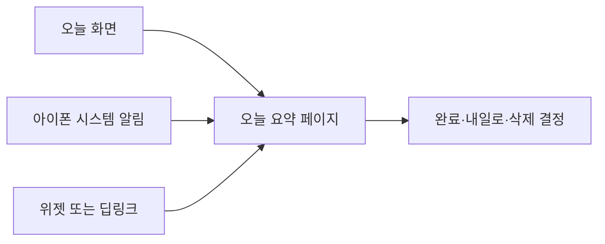
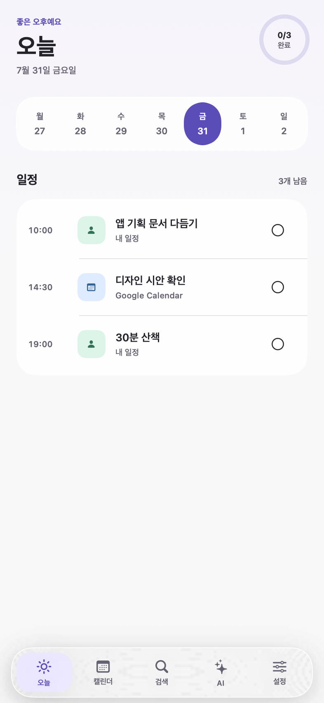
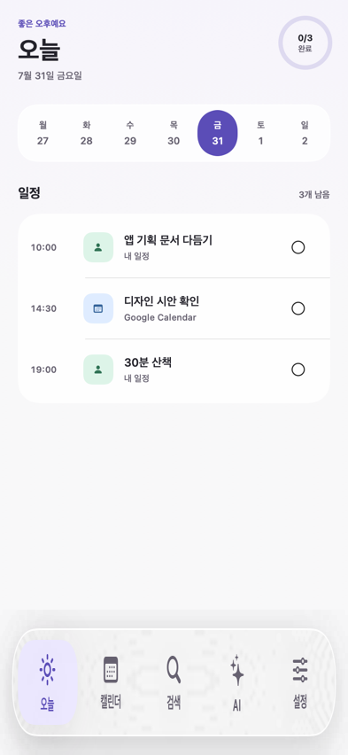
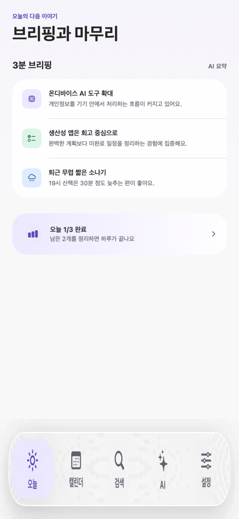
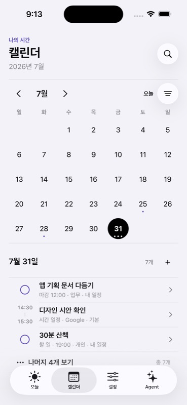
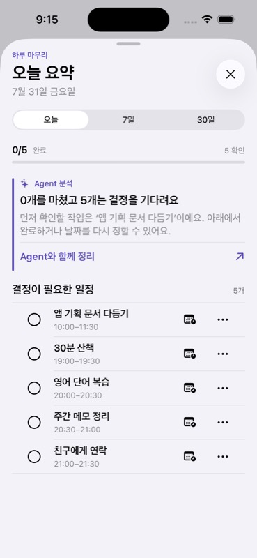
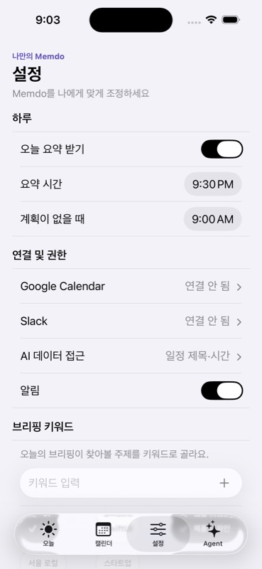
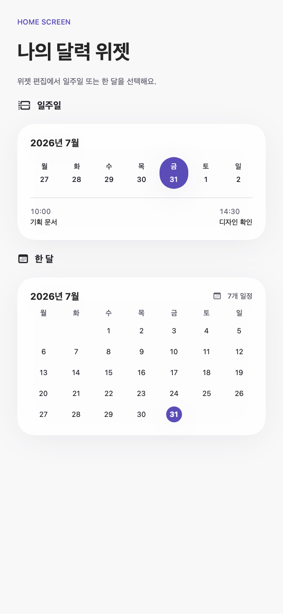
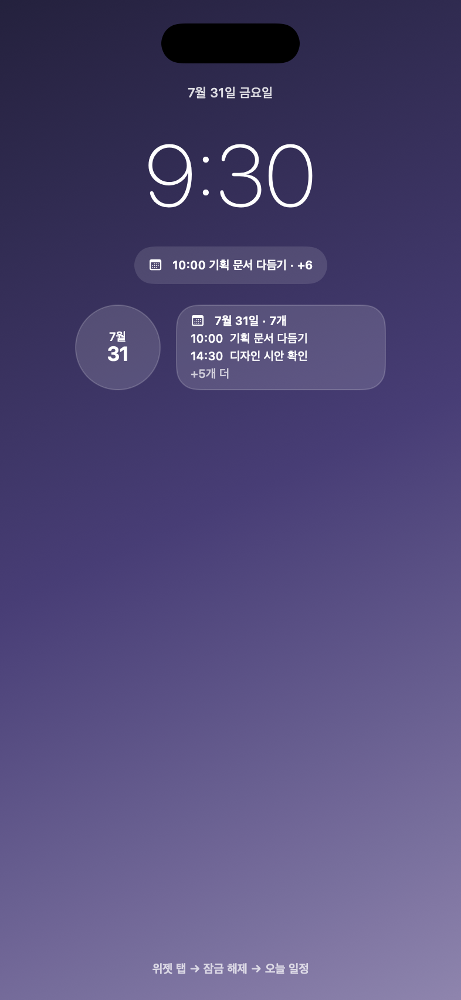

# Memdo Master UI/UX Design

> 상태: UI/UX 기준선 확정 (`v1.2`)
> 기준 기기: iPhone 15, 393×852pt  
> 최소 지원: iOS 17  
> 이 문서는 Memdo 앱과 위젯 UI/UX의 단일 기준 문서다.

밀도·카드 예산·Agent UI를 판단할 때는 [디자인 시스템·밀도·Agent UI 계약](../../../docs/28-design-system-density-and-agent-ui.md)을 함께 적용한다.

## 1. 문서 사용법

새 화면을 설계하거나 구현할 때 다음 순서로 읽는다.

1. 이 문서의 제품 원칙과 화면 구조를 확인한다.
2. 구현하려는 페이지의 상태와 행동 규칙을 확인한다.
3. 공통 컴포넌트와 디자인 토큰을 적용한다.
4. 실제 SwiftUI 파일에서 구현 상태를 확인한다.
5. 접근성 및 완료 체크리스트를 통과시킨다.

구체적인 색상·간격·컴포넌트 값은 이 문서가 우선한다. 구조가 정의되지 않은 경우 TypeUI 기본 원칙을 적용하되, 접근성은 모든 미적 결정보다 우선한다.

## 2. 제품 경험 정의

Memdo는 전문적인 업무 캘린더가 아니라 사용자가 자신의 하루를 가볍게 만들고 정리하는 개인 캘린더다.

핵심 경험은 다음과 같다.

- 계획이 없어도 질문 하나로 하루를 시작할 수 있다.
- 직접 만든 일정과 외부 캘린더 일정을 한눈에 구분할 수 있다.
- 일정이 많아도 모든 항목을 한 화면에 밀어 넣지 않는다.
- AI는 사용자의 확인 없이 일정을 생성하거나 변경하지 않는다.
- 하루가 끝날 때 미완료 일정을 결정할 수 있도록 돕는다.
- 잠금화면과 홈 화면에서 다음 일정을 빠르게 확인할 수 있다.

### 지향하는 인상

- 개인적이고 조용함
- 판단하기 쉬움
- 지나치게 업무 도구처럼 보이지 않음
- AI가 전면에 나서기보다 필요한 순간에 제안함
- 장식보다 정보 구조와 문장에 집중함

### 피해야 할 인상

- 기업용 일정 관리 대시보드
- 카드가 끝없이 나열된 피드
- AI가 마음대로 일정을 변경하는 자동화 도구
- 색상에 의존해야 이해되는 화면
- 모든 일정을 한 번에 보여주는 과밀한 위젯

## 3. 전체 정보 구조

앱의 콘텐츠 탭은 세 개로 고정한다. 검색은 캘린더 안의 도구이며 Agent는 페이지 전환 없이 시트를 여는 네 번째 탭바 액션이다.

| 탭 | 목적 | 대표 행동 |
|---|---|---|
| 오늘 | 오늘의 계획과 다음 행동 확인 | 새 일정 만들기 |
| 캘린더 | 월간 흐름과 선택한 날짜 확인 | 날짜 선택 |
| 설정 | 알림·연동·권한·관심사 설정 | 환경 변경 |

`오늘 요약`은 별도 탭이 아니다. 다음 경로로 들어가는 상세 페이지다.

- 오늘 화면 헤더의 완료 현황 링
- 설정한 시간에 표시되는 아이폰 시스템 알림
- 향후 딥링크 또는 위젯



## 4. 디자인 구축 순서

1. 페이지의 목적과 사용자 상태를 정의한다.
2. TypeUI 배치 패턴을 페이지 목적에 맞게 조합한다.
3. Black & White 와이어프레임에서 정보 구조를 먼저 검증한다.
4. 간격·서체·터치 영역·컴포넌트 규칙을 고정한다.
5. 빈 상태·과다 상태·오류 상태를 확인한다.
6. 이 문서에 확정된 Semantic Mono 색상과 모션 토큰을 적용한다.

색상이나 일러스트로 구조적 문제를 가리지 않는다. 현재 정보 구조·색상·아이콘·내비게이션·위젯 형태는 확정됐으며 변경은 결정 기록을 남긴 뒤 진행한다.

## 5. Semantic Mono 디자인 시스템

### 5.1 색상 토큰

| 토큰 | 값 | 사용처 |
|---|---|---|
| Background | `systemGroupedBackground` | Light/Dark 앱 기본 배경 |
| Surface | `secondarySystemGroupedBackground` | 카드와 입력 영역 |
| Ink | `label` | 본문과 주요 정보 |
| Secondary Ink | `secondaryLabel` | 보조 정보 |
| Outline | `separator` | 구분선 |
| Control Outline | `tertiaryLabel` | 입력 컨트롤 경계 |
| Accent | `label` | 선택과 주요 행동의 흑백 대비 |
| On Accent | `systemBackground` | 선택 면 위 전경 |
| Accent Soft | `tertiarySystemFill` | 선택 전 보조 표면 |
| Brand | Light `#5C4DB8`, Dark `#B8ABFF` | 로고·eyebrow·할 일·Agent 근거 |
| Brand Soft | appearance별 저채도 variant | 브랜드 아이콘의 작은 배경 |

화면 면적은 무채색 90%, 재질과 구분 8%, 브랜드 포인트 2%를 기준으로 한다. 색상은 의미의 유일한 전달 수단으로 사용하지 않으며 선택 상태에는 형태·아이콘·텍스트를 함께 사용한다.

### 5.2 간격

기본 간격 스케일:

`4 / 8 / 12 / 16 / 20 / 24 / 28 / 32pt`

| 관계 | 권장 간격 |
|---|---:|
| 아이콘과 라벨 | 8pt |
| 카드 내부 요소 | 8–12pt |
| 카드 내부 여백 | 12–16pt |
| 같은 섹션의 항목 | 12–16pt |
| 서로 다른 섹션 | 20–24pt |
| 화면 좌우 여백 | 18pt |
| Liquid Glass 탭 바 하단 여유 | 72pt 이상 |

일정·브리핑처럼 서로 다른 행이 한 화면에 이어질 때는 다음 내부 열을 공유한다.

| 내부 행 열 | 값 |
|---|---:|
| 행 좌우 inset | 12pt |
| 상태·시간·번호 선행 열 | 44pt |
| 선행 열과 본문 간격 | 8pt |
| 본문 시작점 | 행 시작 + 64pt |

Task 완료 원, Event 시간축, 브리핑 번호는 선행 열의 중심에 정렬하고 일정·브리핑 제목은 동일한 본문 시작점에 둔다.

### 5.3 모서리와 표면

- 기본 카드 반경: `16pt`
- 큰 위젯·그룹 반경: `22–28pt`
- 작은 아이콘 배경 반경: `8–10pt`
- 캡슐: 날짜 선택, 필터, 주요 플로팅 버튼
- 그림자는 홈 화면 위젯 또는 떠 있는 주요 행동처럼 레이어 구분이 필요한 경우에만 사용한다.

### 5.4 타이포그래피

시스템 폰트와 Dynamic Type을 사용한다.

| 역할 | SwiftUI 기준 |
|---|---|
| 페이지 제목 | 26pt, rounded, bold |
| 섹션 제목 | `.headline` |
| 카드 제목 | `.headline` |
| 본문 | `.body` |
| 보조 설명 | `.subheadline` |
| 메타데이터 | `.caption` / `.caption2` |
| 시간 | monospaced digits |

앱 화면의 제목은 과도하게 크게 만들지 않는다. 한 화면에서 가장 큰 텍스트는 페이지 제목 하나다.

### 5.5 터치와 접근성

- 모든 버튼과 링크의 최소 터치 영역은 `44×44pt`다.
- 인접한 터치 영역은 가능한 한 `8pt` 이상 분리한다.
- 아이콘만 있는 버튼에는 접근성 라벨을 제공한다.
- 본문 텍스트 대비는 최소 `4.5:1`을 유지한다.
- 중요한 상태는 색상만으로 표현하지 않는다.
- 일정 출처는 아이콘과 텍스트를 함께 표시한다.

### 5.6 하단 내비게이션

모든 최상위 탭은 SwiftUI의 네이티브 `TabView`를 공유한다.

- 콘텐츠 탭: 오늘, 캘린더, 설정
- 공통 액션: Agent
- iOS 26 이상: 시스템 Liquid Glass 외형과 스크롤 축소 동작을 그대로 사용한다.
- iOS 17–25: 같은 `TabView`의 시스템 탭 바를 사용한다.
- 탭 선택 상태는 시스템이 제공하는 아이콘·라벨·Accent 틴트를 사용한다.
- 아래로 스크롤할 때 `.tabBarMinimizeBehavior(.onScrollDown)`으로 콘텐츠 영역을 확보한다.
- Liquid Glass는 내비게이션·컨트롤 계층에만 사용하고 일정과 브리핑 콘텐츠 카드에는 적용하지 않는다.
- 오늘 요약·새 일정처럼 별도 시트나 상세 문맥에서는 표시하지 않는다.
- Agent 탭 선택은 커스텀 `Binding`에서 가로채 현재 콘텐츠 탭을 유지하고 시트만 연다. 빈 화면으로 전환한 뒤 되돌리는 구현은 사용하지 않는다.
- 모든 스크롤 페이지는 마지막 행동이 떠 있는 탭 바 아래에 들어가지 않도록 최소 `72pt` 하단 여유를 공유한다.



### 5.7 모션과 피드백

| 동작 | 확정 규칙 |
|---|---|
| 탭 선택·화면 교체 | iOS 시스템 `TabView` 전환 |
| 시트 열기·닫기 | iOS 시스템 시트 전환 |
| 버튼 누름 | 시스템 버튼 상태 + 필요한 경우 가벼운 scale 피드백 |
| 일정 완료 | 체크 상태와 취소선을 함께 갱신 |
| 햅틱 | 저장·완료 성공에만 가벼운 success, 일반 탐색에는 사용하지 않음 |
| 모션 감소 | `accessibilityReduceMotion`에서 커스텀 opacity/scale 모션 제거 |

모션은 디자인 기준으로 확정했지만 실제 액션·딥링크와 함께 기능 단계에서 연결하고 테스트한다.

### 5.8 TypeUI 페이지 조합 규칙

페이지마다 장식을 새로 만들지 않고 목적에 맞는 구조를 다음 순서로 조합한다.

| 페이지 | 고정 위계 |
|---|---|
| 오늘 | 날짜·완료 링 → 일정 밀도 주간 인덱스 → 일정 3개 → 브리핑 |
| 캘린더 | 헤더 검색 → 월간 필터·인덱스 → 선택 날짜 일정 3개 → 더 보기 또는 새 일정 |
| 설정 | 하루 → 연결·권한 → 브리핑 키워드 → 개인정보 |

- 페이지 제목은 `MemdoPageHeader`, 섹션은 `MemdoSection`으로 같은 정렬축을 공유한다.
- 페이지 섹션 사이 간격은 `20pt`, 섹션 제목과 내용 사이는 `12pt`를 기본값으로 한다.
- 주요 행동은 화면당 하나를 우선하고, 보조 행동은 plain 또는 시스템 bordered 버튼으로 낮춘다.
- 첫 viewport의 카드 수는 캘린더 최대 2개, 검색 최대 1개다. 오늘·요약·Agent는 열린 목록을 사용하고 설정은 섹션당 하나의 낮은 대비 Glass 그룹만 사용한다.
- 반복 항목은 카드 여러 개가 아니라 하나의 그룹 안에 행으로 배치하며 카드 안에 카드를 넣지 않는다.
- 긴 목록은 첫 3개와 `MemdoDisclosureRow`로 단계적으로 펼친다. 오늘 화면은 약 120pt 위로 스크롤하면 자동 펼침하며 수동 펼침·접기와 VoiceOver 동작을 함께 유지한다.
- Agent는 별도 페이지 없이 네 번째 시스템 탭 액션으로 둔다. 탭하면 직전 콘텐츠 탭을 유지한 채 Agent 시트를 연다.
- 새 일정은 일정 섹션의 작은 `+`와 날짜 길게 누르기로 진입하고, 화면 하단의 중복 버튼은 두지 않는다.
- 설정·편집·상세는 커스텀 카드 폼을 만들지 않고 네이티브 `Form`, `List`, `Toggle`, `Picker`를 사용한다.
- 인접 행동은 같은 높이와 크기 토큰을 사용하고, 접근성 Dynamic Type에서는 `AnyLayout`으로 세로 배치한다.
- 선택 칩은 Accent 색상만 바꾸지 않고 체크 아이콘과 접근성 선택 상태를 함께 표시한다.
- 접근성 Dynamic Type에서는 장식 아이콘·chevron을 숨겨 본문 폭을 우선하고, 일정 행은 시간·출처와 제목을 두 줄 구조로 재배치한다.
- 주간 레일은 접근성 Dynamic Type에서 가로 스크롤로 전환한다. 월간 그리드는 공간 인덱스 형태를 보존하도록 글자 확대를 `.large`까지 제한하고 각 날짜의 전체 상태는 접근성 값으로 제공한다.
- 설정 시간 선택은 보통 크기에서 한 행, 접근성 Dynamic Type에서 라벨과 선택기를 위아래로 배치한다.

### 5.9 오버레이 선택 규칙

같은 목적은 앱 전체에서 같은 시스템 표현을 사용한다.

| 목적 | 표현 |
|---|---|
| 일정 상세·편집·추가, 브리핑 상세, AI 접근 설명 | 불투명 배경의 네이티브 시트 |
| 삭제처럼 되돌릴 수 없는 행동 | `confirmationDialog` |
| 권한 요청·오류·즉시 판단이 필요한 한 단계 안내 | `alert` |
| 날짜 선택·필터 칩·완료 토글처럼 즉시 되돌릴 수 있는 변경 | 현재 화면 안에서 직접 반영 |

- 하나의 화면은 `Identifiable` 목적지 하나로 시트 진입점을 관리한다.
- 모든 시트는 `memdoSheetPresentation`을 사용해 detent, drag indicator, 불투명 배경을 공유한다.
- 짧은 날짜 탭은 시트를 열지 않는다. 캘린더 날짜의 길게 누르기만 하루 일정 시트를 연다.

## 6. 아이콘 체계

Apple SF Symbols를 기본 아이콘 세트로 사용한다. 한 화면에서 선 굵기와 크기를 통일한다.

| 의미 | SF Symbol | 보조 텍스트 |
|---|---|---|
| 직접 만든 일정 | `person.fill` | 내 일정 |
| 외부 캘린더 | `calendar` | Google 등 출처 |
| AI 분석 | `sparkles` | AI가 본 오늘 |
| 완료 현황 | `chart.bar.fill` | 완료 개수 |
| 시간 | `clock` | 시작 시간 |
| 산책·운동 | `figure.walk` | 일정 제목 |
| 일정 추가 | `plus` / `calendar.badge.plus` | 새 일정 |
| 브리핑 기술 | `cpu` | 기술 요약 |
| 브리핑 생산성 | `checklist` | 생산성 요약 |
| 브리핑 날씨 | `cloud.rain` | 날씨 요약 |
| 삭제 | `trash` | 삭제 |
| 이동 제안 | `arrow.forward.circle.fill` | 이동 시간 |

외부 서비스의 공식 브랜드 로고는 해당 서비스의 브랜드 가이드와 에셋이 준비된 이후에만 사용한다. 그전에는 시스템 `calendar` 아이콘과 출처명을 함께 사용한다.

## 7. 오늘 화면

### 7.1 배치

`Compact Header + Completion Ring + Date Rail + Intention Prompt 또는 Timeline + AI Briefing`

순서:

1. 오늘과 날짜
2. 일주일 날짜 레일
3. 하루 시작 질문
4. 시간순 일정
5. 오늘의 브리핑
완료 현황은 헤더 링 하나로만 제공한다. 화면 하단에 같은 목적의 카드나 버튼을 반복하지 않는다.

### 7.2 화면

| 상단 | 스크롤 하단 |
|---|---|
|  |  |

### 7.3 상태

| 상태 | 표현 |
|---|---|
| 일정 없음 | “오늘은 어떤 하루를 보내고 싶나요?” 질문을 첫 행동으로 강조 |
| 일정 있음 | 시간축에 일정 표시 |
| 일부 완료 | 완료 아이콘, 취소선, 남은 개수 갱신 |
| 일정 과다 | 앱은 첫 3개와 `나머지 N개 보기`, 위젯은 일부와 `+N개 더` 표시 |
| 외부 일정 | 출처 아이콘과 출처명 표시 |
| 날짜 변경 | 선택 날짜의 일정·완료 수·빈 상태·추가 대상 날짜를 함께 갱신 |

### 7.4 하단 버튼

### 7.5 일정 탐색과 상세 흐름

- 캘린더의 날짜를 짧게 누르면 선택 날짜와 화면 안의 일정 목록만 갱신한다. 탐색 중에는 시트를 자동으로 열지 않는다.
- 날짜를 `0.5초` 길게 누르거나 VoiceOver의 `하루 일정 메뉴 열기` 액션을 실행하면 해당 날짜의 빠른 일정 시트가 열린다.
- 지난 날짜는 완료된 기록을 포함해 당시 일정을 보여주고, 기록이 없으면 빈 상태를 보여준다.
- 날짜 시트는 네이티브 `List`를 사용하고, 목록 끝의 `새 일정 추가` 행으로 생성 시트를 연다.
- 날짜 시트의 일정 행도 동일한 일정 상세 시트를 열어 조회·수정 흐름을 끊지 않는다.
- 일정 행을 누르면 출처·시간·장소·알림·반복·메모·완료 상태를 보여주는 상세 시트가 열린다.
- 상세 시트의 완료 처리는 네이티브 토글 행으로 표현하고, 수정은 상단 툴바에서 시작한다.
- 일정 추가·상세·수정 시트는 커스텀 장식 카드 대신 네이티브 `Form`, 섹션, 시스템 툴바를 공유한다.
- 일정 시트는 뒤 화면이 내용에 비치지 않도록 불투명 Background를 사용한다.
- 수정 결과는 공통 `ScheduleStore`에 저장되어 오늘·캘린더·검색에 동일하게 반영된다.
- 오늘 화면의 일정 행과 검색 결과도 동일한 상세 시트를 재사용한다.
- 검색 상세 필터는 출처, 완료 상태, 기간을 조합하며 활성 필터를 결과 위에 텍스트로 표시한다.

`새 일정`은 일정 섹션 오른쪽의 작은 `+`와 날짜 길게 누르기로 연다. 날짜 레일은 숫자 배지 대신 점 1~3개의 밀도 표시를 사용하며 미완료 Task와 Event만 집계하고 완료한 Task는 제외한다. 정확한 개수는 VoiceOver 값으로 제공한다.

일정이 4개 이상이면 첫 3개와 disclosure 행을 기본으로 보여준다. 아래로 스크롤하면 한 번 자동으로 펼치되, 사용자가 직접 접은 뒤에는 화면 상단으로 돌아오기 전까지 자동 펼침을 재실행하지 않는다.

## 8. AI 브리핑

AI 브리핑은 뉴스 피드처럼 전면에 나서지 않는다. AI가 뒤에서 관심사를 정리한 결과를 사용자가 오늘 알아둘 핵심 문장으로만 보여준다.


### 목적

사용자는 약 1분 안에 `브리핑 키워드와 관련된 뉴스`와 `오늘 일정에 영향을 주는 정보`만 확인한다. 일반 생산성 조언과 출처 없는 문장은 브리핑에 넣지 않고 Agent 제안으로 분리한다.

### 구성

- 섹션명: `오늘의 브리핑`
- 섹션 보조 정보: `뉴스 N · 일정 영향 N`
- 기본 구성: 브리핑 키워드 뉴스 2개 + 일정 영향 최대 1개
- 세 항목은 동일한 높이의 압축 행으로 구성한다.
- 각 행은 한 줄 제목과 `출처 · 게시 시각 · 선정 이유`를 표시한다.
- 큰 대표 카드·그라데이션·뉴스 썸네일은 사용하지 않는다.
- 행을 누르면 상세 시트에서 설명을 확장하고, AI의 역할은 그 안의 보조 문장으로만 드러낸다.
- 기본 개수: 3개
- 관심사 기반 최대 개수: 5개

### 문장 규칙

- 제목은 한 줄을 우선한다.
- 요약은 “무슨 일이 있었는가”와 “나에게 어떤 의미인가”를 연결한다.
- 일정에 영향을 줄 수 있으면 구체적인 시간 제안을 포함한다.
- 출처 없는 확정적 표현은 피한다.
- 상세는 요약, 출처, 게시 시각, 선정 이유를 표시한다. 원문 URL이 없는 항목은 서비스 데이터로 노출하지 않는다.
- 일정 영향 항목은 변경을 직접 실행하지 않고 Agent 확인 흐름으로 연결한다.

## 9. 캘린더

### 9.1 배치

`Month Index + Selected Day Agenda`



### 9.2 일정이 많은 경우

선택한 날짜의 일정이 많더라도 첫 화면에 모두 펼치지 않는다.

| 일정 개수 | 기본 표현 |
|---:|---|
| 0 | 빈 상태와 새 일정 행동 |
| 1–3 | 모두 표시 |
| 4개 이상 | 처음 3개 + `N개 일정 더 보기` |

더 보기를 누르면 선택한 날짜의 전체 일정 목록으로 이동한다. 일정은 시작 시간 순서로 정렬한다.

### 9.3 날짜 인덱싱

- 점: 해당 날짜에 일정이 있음
- 검은 원: 선택한 날짜
- 헤더 숫자: 선택 날짜의 전체 일정 수
- Event 행: 왼쪽 시작·종료 시간축, 제목, 캘린더, 출처
- Task 행: 왼쪽 완료 원, 제목, 마감 또는 배정 시간, 캘린더, 출처

## 10. 검색

검색은 별도 탭이나 페이지를 차지하지 않는다. 기본 상태에서는 캘린더 제목 오른쪽에 기능성 Glass 검색 버튼이 있고, 탭하면 같은 헤더 아래에 검색 필드가 펼쳐진다. 닫으면 검색어와 결과를 비우고 월간 캘린더로 돌아간다.

분리된 시스템 검색 툴바는 커스텀 페이지 제목과 다른 정렬축에 놓이고 탭 전환 시 표시 상태가 선점되는 문제가 있어 사용하지 않는다. 검색 입력은 시스템 `TextField`를 사용하고, 세 범위 버튼은 하나의 Glass 범위 그룹 안에서 선택 상태가 이동한다. 검색 필드와 범위 그룹은 iOS 26 `GlassEffectContainer`에서 함께 렌더링하고 구버전은 material fallback을 사용한다.

### 배치

`Header Search Action + Inline Search Field + Search Scope + Filter Summary + Result List`

- 기본 캘린더: 제목과 같은 행에 `검색` 라벨이 포함된 Glass 버튼 노출
- 검색 아이콘 탭: 헤더 아래 검색 필드로 확장하고 키보드 포커스
- 검색 활성화: 전체·내 일정·Google scope 표시
- 검색어 입력: 월간 캘린더 대신 검색 결과 표시
- 닫기: 검색어를 비우고 캘린더로 복귀

### 검색 범위

- 텍스트: 일정 제목, 메모, 장소
- 출처 scope: 전체, 직접 만든 일정, Google Calendar 일정
- 상세 필터: 전체·예정·완료 상태, 전체 기간·최근 2주·이번 주

태그와 취소 상태는 현재 일정 모델에 없으므로 v1 검색 계약에 포함하지 않는다.

### 상태

| 상태 | 표현 |
|---|---|
| 검색 전 | 월간 캘린더와 선택 날짜 일정 |
| 결과 있음 | 날짜순 결과와 출처 |
| 결과 없음 | 검색어·필터 수정 안내 |

현재 v1은 로컬 저장소 검색이라 별도 로딩·네트워크 오류 상태가 없다. 서버 검색이 연결될 때 redacted placeholder와 로컬 결과 유지 정책을 추가한다.

## 11. Agent 진입점과 시트

### 배치

`Context Label + Empty-state Quick Requests + Response 또는 Confirmation + Fixed Composer`

### 핵심 규칙

- Agent는 별도 페이지 없이 오늘·캘린더·설정의 현재 문맥에서 열린다.
- 탭을 눌러도 선택된 콘텐츠 탭과 스크롤 위치는 바뀌지 않는다.
- Agent는 자연어 요청을 일정 제안으로 변환한다.
- 빠른 요청은 빈 상태에서만 3개의 열린 행으로 표시하며, 응답 뒤에는 숨긴다.
- 응답은 말풍선 카드 피드가 아니라 짧은 본문과 브랜드 기준선으로 표시한다.
- Agent 화면의 기본 카드 수는 0개다.
- 작성 중인 요청과 응답은 시트를 닫아도 앱 세션 동안 유지한다. `새 대화`를 누를 때만 초기화한다.
- 제안에는 제목, 시간, 반복, 알림, 출처를 표시한다.
- 사용자가 `일정에 추가`를 누르기 전에는 저장하지 않는다.
- 기존 일정 변경·삭제에도 별도 확인이 필요하다.
- 충돌 일정이 있으면 확인 카드 안에서 먼저 알린다.
- 실행 후 생성·변경된 일정으로 이동할 수 있어야 한다.

### Agent 상태

- 해석 중
- 정보 부족
- 일정 충돌
- 승인 대기
- 실행 중
- 실행 성공
- 실행 실패 및 재시도

## 12. 오늘 요약

### 12.1 알림과 페이지의 차이

오늘 요약은 아이폰 알림 자체가 아니라 앱 내부의 상세 페이지다. 아이폰 알림은 이 페이지로 들어오는 진입점이다.

```text
설정 시간 도달
→ 아이폰 잠금화면·알림센터에 시스템 알림 표시
→ 사용자가 알림을 탭
→ 잠금 해제
→ Memdo 오늘 요약 페이지 열기
```

MVP는 기기에서 예약하는 로컬 알림을 기본으로 한다. 서버에서 요약 생성 완료 시점을 알려야 하는 요구가 생기면 원격 푸시 알림을 추가한다.

### 12.2 알림 예시

```text
제목: 오늘을 정리할 시간이에요
본문: 완료하지 않은 일정 2개가 있어요.
딥링크: memdo://summary?date=2026-07-31
```

### 12.3 페이지 배치

`Completion Progress + AI Insight + Decision Queue`



### 12.4 미완료 일정 처리

각 일정에는 다음 행동을 제공한다.

- 완료
- 내일로 이동
- 삭제

전면에는 왼쪽 완료 원과 오른쪽 `calendar.badge.clock` 아이콘만 표시한다. 아이콘은 내일 이동을 실행하며 VoiceOver에 전체 동작명을 제공한다. 다른 날짜 이동과 `삭제`는 행 오른쪽 `…` 메뉴에 두고, 삭제는 확인 대화상자를 거친다. 페이지 하단의 중복 완료 버튼은 두지 않고 헤더 닫기와 시스템 sheet 제스처를 사용한다.

내일로 이동할 때는 추천 시간이 있으면 먼저 보여주고, 저장 전 사용자가 확인한다.

### 12.5 AI 인사이트

AI 인사이트는 감상문이 아니라 다음 행동을 돕는 근거와 제안이어야 한다.

좋은 예:

> 오후 일정이 반복해서 밀렸어요. 확인 업무를 내일 오전 10시로 옮겨보세요.

피해야 할 예:

> 오늘도 수고했어요. 내일은 더 좋은 하루가 될 거예요.

## 13. 설정

### 배치

`Grouped Form`



### 그룹

- 하루: 오늘 요약 사용 여부, 요약 시간, 무계획 안내 시간
- 연결 및 권한: Google Calendar, 알림, AI 데이터 접근
- 브리핑 키워드: Reddit 관심사 선택처럼 직접 입력하거나 제안 키워드 중 최대 5개 선택
- 개인정보: 수집 범위, 보관 기간, 철회

알림 시간 변경과 비활성화는 별도 저장 버튼 없이 즉시 반영하되, 시스템 권한이 꺼져 있으면 설정 앱 이동 안내를 제공한다.

## 14. 위젯

### 14.1 목적

- 잠금화면에서 다음 일정과 남은 개수 확인
- 홈 화면에서 날짜·주간 흐름·오늘 일정 확인
- 탭하면 잠금 해제 후 해당 날짜의 앱 화면으로 이동

### 14.2 최신 구조



### 14.3 규격별 표시

| 위젯 | 표시 내용 | 일정이 많은 경우 |
|---|---|---|
| Accessory Inline | 다음 일정 1개 | `+N` |
| Accessory Circular | 월과 날짜 | 일정 내용 미표시 |
| Accessory Rectangular | 날짜, 일정 2개 | `+N개 더` |
| System Small | 큰 날짜, 일정 2개 | `+N개 더` |
| System Medium | 주간 달력, 일정 3개 | `+N개 더` |
| Calendar Medium | 설정에 따라 일주일 또는 한 달 | 일정 수와 핵심 일정만 표시 |
| Calendar Large | 설정에 따라 일주일 또는 한 달 | 더 넓은 월간·주간 밀도 |

잠금화면 위젯은 iOS 시스템 틴트에 맞춘 단색 표현을 사용한다.



### 14.4 정렬 우선순위

1. 현재 시각 이후 가장 가까운 일정
2. 사용자가 고정한 일정
3. 시작 시간이 있는 일정
4. 종일 일정

완료한 일정은 기본 위젯에서 제외한다. 모든 일정이 완료되면 완료 메시지와 다음 날 첫 일정을 보여준다.

### 14.5 위젯 딥링크

| 표면 | 딥링크 |
|---|---|
| 오늘 위젯 | `memdo://today` |
| 날짜 위젯 | `memdo://calendar?date=YYYY-MM-DD` |
| 요약 알림 | `memdo://summary?date=YYYY-MM-DD` |
| 검색 결과 | `memdo://event/{eventId}` |

## 15. 빈 상태

### 오늘 일정 없음

주요 문장:

> 오늘은 어떤 하루를 보내고 싶나요?

보조 문장:

> 계획이 비어 있을 때 가볍게 시작해보세요.

사용자가 누르면 새 일정 시트를 연다. AI 대화를 강제하지 않는다.

### 검색 결과 없음

- 검색어 수정
- 출처 필터 해제
- AI에게 자연어로 찾아달라고 요청

### 요약할 일정 없음

- “오늘 일정은 모두 정리됐어요.”
- 불필요한 결정 카드 숨김
- 내일 첫 일정 또는 짧은 마무리 문장 표시

## 16. 일정 출처와 인덱싱

일정 출처는 항상 데이터와 UI 양쪽에서 식별 가능해야 한다.

| 출처 | UI 표현 |
|---|---|
| Memdo 직접 생성 | `person.fill` + 내 일정 |
| Google Calendar | `calendar` + Google |
| AI 제안 후 승인 | 생성 출처 라벨 + AI 제안 이력 |
| 반복 규칙 생성 | 반복 아이콘 + 반복 설명 |

AI가 제안한 일정도 사용자가 승인한 뒤에는 일반 일정과 동일하게 취급한다. 다만 감사 기록에는 제안 주체와 승인 시점을 남긴다.

## 17. 공통 컴포넌트

| 컴포넌트 | 책임 |
|---|---|
| `MemdoPageHeader` | 화면 목적과 날짜·설명 |
| `MemdoSection` | 섹션 제목·보조 정보·내용의 정렬과 간격 |
| `MemdoDisclosureRow` | 첫 3개 이후 목록 펼치기·접기 |
| Date Rail | 인접 날짜 이동 |
| Intention Prompt | 계획이 없을 때 첫 행동 |
| Schedule Row | 오늘·캘린더·검색에서 시간, 제목, 출처, 완료를 문맥별 표시 |
| Briefing Row | 공통 44pt 선행 열의 번호, 제목, 출처·선정 이유 |
| Schedule Source Icon | 직접 일정과 외부 일정의 아이콘·색상 |
| Schedule Editor Fields | 네이티브 Form 섹션으로 추가·수정의 날짜, 시간, 장소, 알림, 반복, 메모 공유 |
| Schedule Detail Sheet | 네이티브 Form 기반 조회, 완료 토글, 수정·저장 |
| Proposal Card | AI 일정 제안과 승인 |
| Decision Row | 완료·이동 + `…` 삭제 메뉴 |
| Summary Insight | AI 근거와 다음 행동 |
| `MemdoChoiceButton` | 2–5개의 짧은 선택 항목, 체크 아이콘, 선택 접근성 상태 |
| `MemdoButtonLabel` | 주요·보조 텍스트 버튼의 서체와 최소 터치 높이 |
| `MemdoIconButtonLabel` | 아이콘 버튼의 `44×44pt` 터치 영역 |
| `memdoGlassPanel` | 설정처럼 비대화하지 않는 비상호작용 Glass 그룹과 구버전 material fallback |
| `memdoSheetPresentation` | 시트의 detent, drag indicator, 불투명 배경 |
| `SettingsGroup` | 설정 섹션과 최소 `52pt` 행 높이 |
| `SettingsTimePicker` | 보통·접근성 글자 크기에 맞춰 시간 라벨과 시스템 선택기를 재배치 |

반복되는 컴포넌트만 공통화한다. 한 화면에서 한 번만 쓰는 구조를 미리 추상화하지 않는다.

## 18. 구현 파일

| 파일 | 책임 |
|---|---|
| `Memdo/MemdoApp.swift` | 앱 진입점 |
| `Memdo/AppShellView.swift` | 탭 구성과 딥링크 라우팅 |
| `Memdo/TodayView.swift` | 오늘 화면 상태와 사용자 액션 조정 |
| `Memdo/TodayComponents.swift` | 오늘 화면의 헤더·날짜·일정·브리핑 섹션 |
| `Memdo/CalendarView.swift` | 월간 캘린더·헤더 검색·종류 필터·날짜 일정·빠른 일정 시트 |
| `Memdo/ScheduleSearchView.swift` | 캘린더에 삽입되는 일정 검색 결과·필터·요약 |
| `Memdo/AssistantView.swift` | 공통 Agent 문맥 시트·입력기 |
| `Memdo/DailySummaryView.swift` | 하루 완료 현황과 미완료 결정 |
| `Memdo/SettingsView.swift` | 알림·연결·동의·관심사 설정 |
| `Memdo/ScheduleModel.swift` | 일정 모델·샘플·공유 저장소 |
| `Memdo/ScheduleRow.swift` | 오늘·캘린더·검색 공통 일정 행과 출처 아이콘 |
| `Memdo/ScheduleSheets.swift` | 일정 추가·상세·수정 Form |
| `Memdo/MemdoTheme.swift` | Semantic Mono·브랜드 포인트·간격·반경 토큰 |
| `Memdo/MemdoComponents.swift` | 페이지·섹션·버튼 등 화면 공통 컴포넌트 |
| `MemdoWidget/MemdoWidget.swift` | 잠금화면 및 홈 화면 위젯 |
| `project.yml` | XcodeGen 프로젝트 설정 |

피드백 수정 위치는 다음처럼 고정한다.

| 피드백 | 우선 수정 파일 |
|---|---|
| 전체 색상·간격 | `MemdoTheme.swift` |
| 버튼 높이·선택 칩·공통 그룹 | `MemdoComponents.swift` |
| 오늘 화면 섹션 외형 | `TodayComponents.swift` |
| 일정 모델·저장 규칙 | `ScheduleModel.swift` |
| 일정 행·출처 아이콘 | `ScheduleRow.swift` |
| 일정 상세·추가 폼 | `ScheduleSheets.swift` |
| 탭·딥링크 | `AppShellView.swift` |
| Xcode 타깃·Scheme·빌드 설정 | `project.yml` 후 `xcodegen generate` |

## 19. 디자인 기준선 이후의 미결정 항목

다음 항목은 v1 디자인을 변경하지 않고 별도 후속 결정으로 다룬다.

- 커스텀 앱 아이콘
- 앱 전용 Light/Dark 강제 전환 필요성
- 브랜드 일러스트
- iPad 전용 레이아웃

기본 색상, 탭 구조, 화면 구성, 위젯 형태와 모션 원칙은 확정 상태다.

## 20. 디자인 완료 체크리스트

### 페이지

- [x] 페이지의 대표 행동이 하나인가?
- [x] 빈 상태와 과다 상태가 정의되어 있는가?
- [x] 스크롤 콘텐츠가 하단 고정 버튼에 가려지지 않는가?
- [x] AI 실행 전 사용자 확인이 있는가?
- [x] 외부 일정 출처가 텍스트로도 구분되는가?

### 컴포넌트

- [x] 터치 영역이 최소 44×44pt인가?
- [x] 아이콘만 있는 버튼에 접근성 라벨이 있는가?
- [x] 버튼 라벨이 줄바꿈되지 않는가?
- [x] 배지는 내용 너비만 차지하는가?
- [x] 같은 그룹의 버튼 높이가 동일한가?
- [x] 접근성 Dynamic Type에서 인접 버튼이 세로로 전환되는가?
- [x] 선택 상태가 색상 외 아이콘·텍스트 상태로도 전달되는가?

### 위젯

- [ ] 위젯 크기별 정보량이 제한되어 있는가?
- [ ] 일정이 많을 때 `+N개 더`가 정확한가?
- [ ] 완료 일정이 제외되는가?
- [ ] 탭 딥링크가 올바른 화면을 여는가?
- [ ] 시스템 틴트에서도 의미가 유지되는가?

### 오늘 요약

- [x] 아이폰 시스템 알림과 앱 내부 페이지가 구분되는가?
- [x] 미완료 일정마다 다음 행동이 있는가?
- [x] 두 전면 행동의 높이와 위계가 일관적인가?
- [x] 삭제가 `…` 메뉴와 확인 대화상자에 있는가?
- [x] 삭제 전에 확인 대화상자가 표시되는가?
- [x] AI 제안이 구체적인 시간 또는 행동을 포함하는가?
- [x] 사용자 승인 전 일정이 변경되지 않는가?

## 21. 현재 승인 기준

현재 승인 완료 항목은 다음과 같다.

- 페이지별 정보 구조
- Semantic Mono 색상 토큰과 시스템 Light/Dark 적응
- 탭 구조
- 네이티브 Liquid Glass 하단 내비게이션
- 오늘 화면의 흐름
- AI 브리핑의 역할
- 오늘 요약의 알림 및 상세 페이지 관계
- 일정 과다 표시 규칙
- 달력형 위젯 구조
- SF Symbols 아이콘 체계
- 주간·월간 설정형 홈 화면 위젯
- 잠금화면 위젯 3종
- 모션 및 햅틱 원칙

## 22. 관련 문서 읽기 순서

전체 제품을 이해할 때는 다음 순서로 읽는다.

1. `00-product-brain-map.md`: 전체 문서 지도와 기준
2. `01-product-requirements.md`: 제품 목표와 기능 요구사항
3. `27-page-ui-ux-contract.md`: 페이지별 목적, 위계, 행동, 상태
4. `28-design-system-density-and-agent-ui.md`: 사용자 취향, 카드 예산, Agent·모달 규칙
5. 이 문서 `DESIGN.md`: 디자인 토큰, 공통 컴포넌트, 위젯
6. `07-notification-and-daily-review.md`: 아이폰 알림과 오늘 요약 정책
7. `06-privacy-consent-ai-policy.md`: AI 접근 범위와 사용자 동의
8. `03-technical-architecture.md`: 앱·백엔드·AI의 연결 구조
9. `04-data-model.md`: 화면에 표시되는 데이터 필드
10. `18-todo-search-pipeline.md`: 일정 검색 동작
11. `20-ai-agent-architecture.md`: AI 제안과 실행 승인 구조
12. `21-integration-hub-google-calendar-mcp.md`: 외부 캘린더와 MCP
13. `25-api-contract-completeness.md`: 화면과 API 계약
14. `08-test-and-release-plan.md`: 상태별 검증과 출시 조건

문서 간 값이 충돌하면 다음 우선순위를 적용한다.

1. 결정 기록과 canonical rule
2. 제품 요구사항
3. 이 디자인 문서
4. 기능별 세부 문서
5. 구현 코드

구현 코드가 상위 문서와 다르면 코드를 기준으로 문서를 바꾸지 않는다. 먼저 의도된 변경인지 확인하고 결정 기록을 갱신한 뒤 관련 문서를 함께 수정한다.
