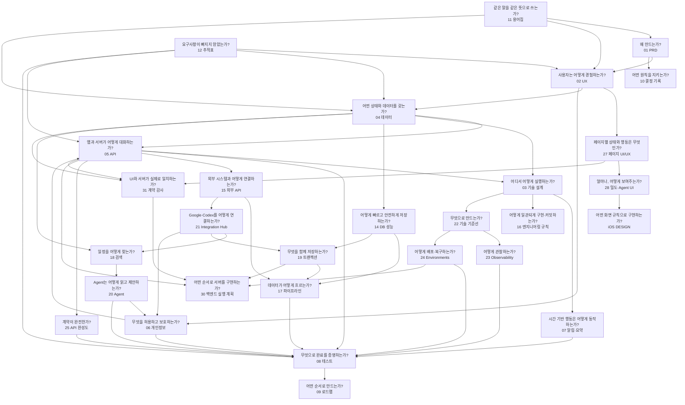

# Memdo 제품 뇌 지도

이 문서는 모든 문서의 시작점이다. 기능을 만들거나 변경하기 전에 여기서 해당 결정의 원인과 영향을 찾는다.

## 1. 문서가 답하는 질문



## 2. 기본 읽기 순서

처음 프로젝트에 참여한 사람은 아래 순서로 읽는다.

1. [제품 뇌 지도](./00-product-brain-map.md)
2. [공통 용어집](./11-glossary-and-canonical-rules.md)
3. [제품 요구사항](./01-product-requirements.md)
4. [결정 기록](./10-decisions-and-open-questions.md)
5. [UX와 화면](./02-ux-and-screens.md)
6. [페이지별 UI/UX 계약](./27-page-ui-ux-contract.md)
7. [디자인 시스템·밀도·Agent UI 계약](./28-design-system-density-and-agent-ui.md)
8. [최종 UI/UX 기준선](../apps/ios/Memdo/DESIGN.md)
9. [개인정보·동의·AI 정책](./06-privacy-consent-ai-policy.md)
10. [데이터 모델](./04-data-model.md)
11. [알림과 하루 요약](./07-notification-and-daily-review.md)
12. [기술 아키텍처](./03-technical-architecture.md)
13. [OpenAPI](./05-api-spec.yaml)
14. [요구사항 추적표](./12-requirements-traceability.md)
15. [테스트와 출시](./08-test-and-release-plan.md)
16. [로드맵](./09-roadmap-and-backlog.md)
17. [문서 변경 규칙](./13-document-governance.md)
18. [DB 성능·운영](./14-database-performance-and-operations.md)
19. [외부 API 통합](./15-external-integrations-and-naming.md)
20. [엔지니어링·커밋 규칙](./16-engineering-and-commit-rules.md)
21. [데이터 파이프라인](./17-data-pipeline.md)
22. [일정 검색 파이프라인](./18-todo-search-pipeline.md)
23. [트랜잭션 경계](./19-transaction-boundaries.md)
24. [AI Agent 설계](./20-ai-agent-architecture.md)
25. [Integration Hub](./21-integration-hub-google-calendar-mcp.md)
26. [기술 스택 기준선](./22-technology-stack-baseline.md)
27. [관찰 가능성](./23-observability-and-alerting.md)
28. [환경·CI/CD·백업](./24-environments-ci-cd-backup.md)
29. [API 계약 완성도](./25-api-contract-completeness.md)
30. [전체 문서 정합성 감사](./26-document-consistency-audit.md)
31. [백엔드 구현 실행 계획](./30-backend-implementation-plan.md)
32. [UI ↔ 백엔드 계약 감사](./31-ui-backend-contract-audit.md)
33. [Agent 수동 테스트 계획](./32-agent-manual-test-plan.md)
34. [Experience 로드맵](./33-experience-roadmap.md)

구현자는 첫 migration 또는 API client 생성 전에 `26`의 P0 항목이 해소됐는지 확인한다.

## 3. 역할별 읽기 순서

### 제품 기획

```text
00 → 11 → 01 → 10 → 02 → 27 → 28 → 06 → 12 → 09
```

### iOS 개발

```text
00 → 11 → 01 → 02 → 27 → 28 → iOS DESIGN → 04 → 07 → 03 → 05 → 08
```

### 백엔드 개발

```text
00 → 11 → 01 → 06 → 04 → 14 → 18 → 19 → 05 → 15 → 17 → 20 → 03 → 16 → 08 → 31 → 30
```

### 디자인

```text
00 → 11 → 01 → 10 → 02 → 27 → 28 → iOS DESIGN → 06 → 07
```

### QA

```text
00 → 11 → 01 → 02 → 04 → 07 → 12 → 08
```

### 개인정보·법무 검토

```text
00 → 01 → 06 → 04 → 05 → 08
```

## 4. 제품의 핵심 인과관계

### 계획이 없는 날

```text
사용자 문제
→ PRD-003
→ Today Empty 화면
→ DayView.emptyState
→ GET /days/{date}
→ 빈 일정 UI 테스트
```

### 하루 요약

```text
사용자가 완료 처리를 잊음
→ PRD-004~007
→ 요약 시간 설정 + 일정별 질문
→ DAILY_REVIEWS + REVIEW_RESPONSES
→ /daily-review/settings + /daily-reviews/*
→ 상태 전이 및 실제 알림 테스트
```

### 상시 Agent 계획

```text
자연어로 계획하고 싶음
→ PRD-013~016
→ 시스템 탭바 Agent 액션 + 변경안 확인 시트
→ Consent + AgentRun + Draft
→ /ai/plan-drafts + commit
→ 동의·미승인 저장 방지 테스트
```

### 잠금화면

```text
오늘을 빠르게 확인하고 싶음
→ PRD-010~011
→ 잠금화면 위젯
→ WidgetSnapshot
→ App Group + Universal Link
→ 실제 기기 잠금·딥링크 테스트
```

## 5. 진실의 원천

같은 내용이 충돌하면 아래 우선순위를 따른다.

1. 승인된 ADR과 개인정보 정책
2. 제품 요구사항
3. 공통 용어와 상태 규칙
4. 데이터 모델
5. OpenAPI
6. UX 상세
7. 기술 구현 설명
8. 로드맵

단, 실제 구현이 문서와 다르면 구현을 정답으로 간주하지 않는다. 차이를 버그 또는 문서 변경 제안으로 기록한다.

## 6. 변경 영향 지도

| 변경 대상 | 반드시 함께 확인 |
|---|---|
| 요구사항 | UX, 데이터, API, 테스트, 추적표 |
| Todo 상태 | 용어집, ERD, API enum, 하루 요약, 테스트 |
| 화면 필드 | 데이터 필드, API 응답, 개인정보 노출 |
| 알림 문구·액션 | UX, 상태 전이, 알림 정책, 실제 기기 테스트 |
| AI 데이터 범위 | 동의 정책, API, 감사 로그, 테스트 |
| 반복 규칙 | 데이터 제약, 서버 작업, API, 타임존 테스트 |
| 위젯 표시 | 개인정보 숨김, 스냅샷, 딥링크, 실제 기기 테스트 |
| 조회 경로 | ERD, 인덱스, OpenAPI pagination, EXPLAIN, 성능 목표 |
| 외부 공급자 | 동의, 포트·어댑터, 오류 코드, 파이프라인, 운영 메트릭 |
| 작업 큐 | pgmq, async operation, 멱등성, 재시도, 모니터링, 실패 UX |
| 검색 | 검색 필드, 개인정보, 인덱스, 랭킹, Agent 도구, 검색 평가 |
| 트랜잭션 | 함께 성공할 행, 외부 부작용, 멱등성, 충돌, 동시성 테스트 |
| Agent 도구 | 동의 범위, 입력·출력 스키마, 승인 UI, 감사, eval |
| Google·MCP 연동 | OAuth scope, 외부 미러, 출처 UI, proposal, 승인 링크, 충돌 |
| 기술 스택 | 언어, 런타임, cloud, exact version 파일, 비용, 전환 조건 |
| 관찰 | metric, log, trace, 개인정보, dashboard, alert |
| 배포 | 환경, migration, CI, backup, restore, rollback |
| API 공통 | 오류, rate limit, cursor, idempotency, version, request ID |
| 문서 감사 결과 | ADR, UX, 데이터, OpenAPI, 추적표, 구현 시작 조건 |
| UI·백엔드 불일치 | 화면 모델, DTO, OpenAPI, migration, 단계, 통합 테스트 |

## 7. 기능을 추가하는 사고 순서

```text
사용자 문제
→ 요구사항 ID
→ 사용자 흐름
→ 권한과 개인정보
→ 상태와 데이터
→ API 계약
→ 실행 위치
→ 실패·오프라인 처리
→ 테스트 증거
→ 로드맵 배치
```

이 순서를 거꾸로 시작하지 않는다. API나 테이블부터 만든 기능은 사용자 문제와 연결되지 않을 가능성이 높다.
