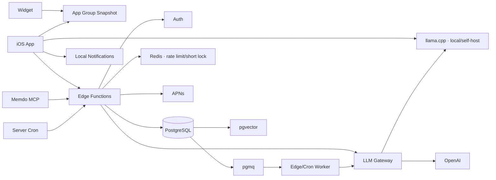

# 기술 설계

> 입력 계약: [데이터 모델](./04-data-model.md), [API 명세](./05-api-spec.yaml)  
> 정책 제약: [개인정보 정책](./06-privacy-consent-ai-policy.md), [알림 정책](./07-notification-and-daily-review.md)  
> 검증: [테스트 계획](./08-test-and-release-plan.md)
> 성능·운영: [DB 성능 설계](./14-database-performance-and-operations.md), [데이터 파이프라인](./17-data-pipeline.md)  
> 외부 경계: [외부 API 통합](./15-external-integrations-and-naming.md)
> 확정 스택: [기술 스택 기준선](./22-technology-stack-baseline.md)  
> 운영: [관찰 가능성](./23-observability-and-alerting.md), [환경·배포·백업](./24-environments-ci-cd-backup.md)

## 1. 스택

이 문서의 제품 구조가 정답이며 exact 언어·런타임·클라우드 선택은 [기술 스택 기준선](./22-technology-stack-baseline.md)을 정답으로 사용한다.

### iOS

- Swift 6
- SwiftUI
- SwiftData
- WidgetKit
- App Intents
- UserNotifications
- EventKit
- Keychain
- App Group

최소 지원 버전은 iOS 17로 시작한다.

### 서버

- TypeScript 5.x
- Deno-compatible Supabase Edge Runtime
- Supabase Auth
- PostgreSQL
- Row Level Security
- Edge Functions
- Supabase Cron
- Supabase Queues (pgmq)
- pgvector
- Upstash Redis REST for expiring AI/MCP state only
- APNs
- OpenAI Responses API
- llama.cpp local development adapter

## 2. 시스템 구조



MCP, iOS, scheduled worker는 별도 비즈니스 규칙을 만들지 않고 같은 application query/command를 사용한다. MCP와 LLM에는 DB 권한을 주지 않는다.

서버 요청 흐름:

```text
HTTP/MCP adapter
→ Request DTO validation
→ Application Query/Command
→ Supabase client 또는 SQL RPC
→ Response DTO
```

## 3. 일정 및 알림 책임

| 기능 | 실행 위치 |
|---|---|
| 단일 일정 저장 | 앱 로컬 저장 후 서버 동기화 |
| 반복 인스턴스 생성 | 서버 |
| 가까운 일정 알림 | iOS 로컬 알림 |
| 서버 변경 알림 | APNs |
| 하루 요약 알림 | 로컬 알림 우선 |
| 기기 간 요약 설정 동기화 | 서버 |
| 미완료 상태 계산 | 앱과 서버의 공통 규칙 |
| AI 계획 초안 | 서버 |

하루 요약은 정해진 문구와 상태 규칙으로 동작하며 AI 호출이 필요 없다.

## 4. 하루 요약 알고리즘

```text
입력:
  사용자 타임존
  review_time
  오늘의 일정

대상:
  scheduled_date == 오늘
  status in planned, in_progress, partial
  deleted_at is null

제외:
  completed, skipped, cancelled, rescheduled

처리:
  대상이 없으면 축하 요약만 표시
  대상이 있으면 sort_order, start_at 순으로 질문
  각 응답을 즉시 로컬 저장
  온라인이면 서버 동기화
```

## 5. 반복 일정

- UI preset은 daily, weekdays, weekly, biweekly, monthly, yearly를 지원한다. 서버는 이를 검증된 RRULE subset으로 정규화한다.
- custom RRULE은 `FREQ=DAILY|WEEKLY|MONTHLY|YEARLY`, `INTERVAL`, `BYDAY`와 preset에 필요한 최소 속성만 허용한다.
- 서버는 향후 30일 인스턴스를 유지한다.
- 같은 `schedule_rule_id + occurrence_date`는 하나만 생성한다.
- 규칙 변경 시 사용자 현지 오늘 이후의 수정되지 않은 인스턴스만 재생성한다.
- Todo에 `isRecurrenceException=true`인 사용자가 수정한 인스턴스는 보존한다.
- 규칙 비활성화는 미래의 수정되지 않은 인스턴스를 취소하고 과거 기록은 유지한다.
- 규칙과 Todo 모두 `version`으로 동시 수정을 검사한다.

## 6. 오프라인과 동기화

- 쓰기는 SwiftData에 먼저 반영한다.
- 변경 항목에 `syncState = pending`을 표시한다.
- 앱 활성화, 백그라운드 기회, 수동 새로고침 시 동기화한다.
- 서버는 `updated_at` 커서를 반환한다.
- 서버 `version` 기반 optimistic concurrency를 사용한다.
- stale `baseVersion`은 `409 RESOURCE_VERSION_CONFLICT`를 반환한다.
- sync batch는 mutation별 트랜잭션으로 처리해 한 충돌이 전체 batch를 막지 않게 한다.
- 완료 응답에는 idempotency key를 사용해 중복 처리를 막는다.
- 로그인 전 생성한 UUID를 로그인 후에도 유지한다.
- 같은 UUID만 같은 엔터티로 업서트하며 제목·날짜 기반 자동 병합은 하지 않는다.
- sync push는 mutation별 `applied|conflict|rejected`와 최신 server version을 반환한다.
- 로그아웃은 계정 cache를 제거하지만 로그인 전 로컬 전용 데이터는 유지한다.

Day 상태 계산:

```text
활성 미완료 Todo 존재 → planned
활성 Todo가 있고 정리 대상 없음 → completed
완료 Todo만 존재 → completed
삭제 이력만 있거나 Todo 없음 → needs_planning
```

## 7. 위젯 스냅샷

App Group에 전체 DB를 공유하지 않고 표시용 JSON만 저장한다.

```json
{
  "updatedAt": "2026-08-03T15:00:00+09:00",
  "days": [
    {
      "date": "2026-08-03T00:00:00+09:00",
      "completedCount": 2,
      "items": [
        {
          "id": "uuid",
          "time": "10:00",
          "title": "기획 문서 다듬기",
          "kind": "event"
        }
      ]
    }
  ]
}
```

앱은 현재 월 시작부터 다음 달 말까지의 표시용 일정만 날짜별로 기록한다. 위젯은 이 스냅샷으로 오늘·주간·월간 밀도와 자정 전환을 계산하며 네트워크에 직접 접근하지 않는다. 제목 숨김 설정은 같은 App Group의 `hide-widget-content` 키로 공유한다.

## 8. 딥링크

Universal Link를 기본으로 사용한다.

```text
https://memdo.example/today
https://memdo.example/plan/new
https://memdo.example/todos/{id}
https://memdo.example/review/{date}
https://memdo.example/briefings/{date}
```

앱의 단일 `AppRouter`가 URL을 파싱한다.

## 9. 서버 작업

### 매시간

- 활성 반복 규칙에서 필요한 인스턴스 채우기
- 만료된 연결 토큰 상태 갱신

### 사용자 현지 자정 이후

- 오늘 스냅샷 준비
- 필요 시 브리핑 작업 생성

### 사용자가 정한 요약 시간

로컬 알림이 기본이다. 서버는 여러 기기 동기화와 누락 복구만 담당한다.

## 10. 보안

- Supabase RLS: `user_id = auth.uid()`
- API에서 리소스 소유권 재검증
- 외부 토큰은 서버 암호화 저장
- OpenAI 키는 서버 환경 변수
- Agent 도구에 직접 SQL 권한을 주지 않음
- 변경 도구는 승인 토큰 또는 확정 API 필요
- Agent 실행과 변경 작업을 감사 로그에 기록
