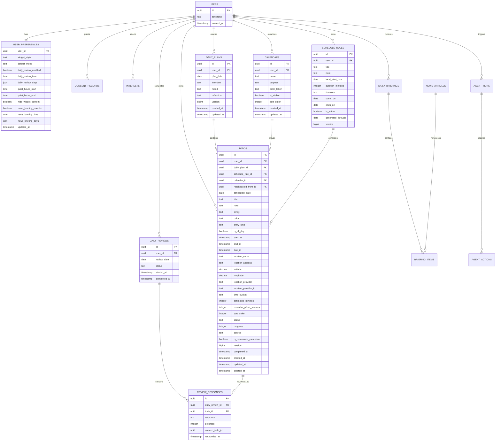

# 데이터 모델과 ERD

> 사용자 흐름: [UX 명세](./02-ux-and-screens.md)  
> 정규 용어와 상태: [공통 용어집](./11-glossary-and-canonical-rules.md)  
> 네트워크 표현: [API 명세](./05-api-spec.yaml)  
> 상태 전이: [알림과 하루 요약](./07-notification-and-daily-review.md)

## 1. ERD



## 2. Todo 필드 사전

| 필드 | 타입 | 필수 | 설명 |
|---|---|---:|---|
| id | UUID | 예 | 일정 ID |
| userId | UUID | 예 | 소유 사용자 |
| dailyPlanId | UUID? | 아니오 | 오늘 계획 |
| scheduleRuleId | UUID? | 아니오 | 반복 규칙 |
| calendarId | UUID | 예 | 사용자 캘린더. 가입 시 `개인`, `업무` 기본 생성 |
| scheduledDate | Date | 예 | 사용자 현지 날짜 |
| title | String | 예 | 최대 120자 |
| note | String? | 아니오 | 최대 2,000자 |
| emoji | String? | 아니오 | 단일 grapheme |
| color | Enum? | 아니오 | 디자인 토큰 ID |
| startAt | DateTime? | 아니오 | 절대 시각 |
| endAt | DateTime? | 아니오 | 절대 시각 |
| dueAt | DateTime? | 아니오 | Task 전용 마감; Event는 null |
| locationName | String? | 아니오 | 장소 표시명 |
| locationAddress | String? | 아니오 | 검색 결과 주소 |
| latitude/longitude | Decimal? | 아니오 | 지도 열기와 근접 검색용 좌표 |
| locationProvider | Enum? | 아니오 | apple_maps/google_places/manual |
| locationProviderId | String? | 아니오 | 공급자 장소 식별자; 외부 API 재조회에 사용 |
| timeBucket | Enum | 예 | morning/afternoon/evening/anytime |
| estimatedMinutes | Int? | 아니오 | 1~1440 |
| reminderOffsetMinutes | Int? | 아니오 | 시작 전 로컬 알림 분; 0~10080 |
| sortOrder | Int | 예 | 같은 구간 안의 사용자 정렬 |
| status | Enum | 예 | 아래 상태표 |
| progress | Int? | 아니오 | 0~100 |
| source | Enum | 예 | manual/ai/recurring/imported |
| isRecurrenceException | Bool | 예 | 반복 규칙 재생성에서 보존할 사용자 수정 여부; 기본 false |
| rescheduledFromId | UUID? | 아니오 | 재예약 원본 Todo |
| version | Int | 예 | 동시 수정 감지용 서버 버전 |
| completedAt | DateTime? | 아니오 | 완료 시각 |
| createdAt | DateTime | 예 | 생성 |
| updatedAt | DateTime | 예 | 최종 수정 |
| deletedAt | DateTime? | 아니오 | 소프트 삭제 |

## 3. 상태

```text
planned
in_progress
partial
completed
skipped
rescheduled
cancelled
```

시간이 지났다는 이유만으로 상태를 자동 변경하지 않는다. 하루 요약 대상 여부는 날짜와 현재 상태로 계산한다.

## 4. 하루 요약 응답

```text
completed
partial
skipped
reschedule_tomorrow
reschedule_custom
leave_planned
```

### 처리 규칙

| 응답 | 원본 상태 | 추가 처리 |
|---|---|---|
| completed | completed | completedAt 저장 |
| partial | partial | progress 저장 |
| skipped | skipped | 없음 |
| reschedule_tomorrow | rescheduled | 내일 복제 |
| reschedule_custom | rescheduled | 선택 날짜 복제 |
| leave_planned | planned | 상태 유지 |

반복 일정 인스턴스를 옮겨도 반복 규칙은 변경하지 않는다.

## 5. 제약조건

```sql
unique (user_id, plan_date)
unique (schedule_rule_id, scheduled_date)
unique (user_id, review_date)
check (progress between 0 and 100)
check (end_at is null or start_at is null or end_at > start_at)
check (entry_kind in ('event', 'task'))
check (entry_kind = 'task' or due_at is null)
check (estimated_minutes is null or estimated_minutes between 1 and 1440)
check (reminder_offset_minutes is null or reminder_offset_minutes between 0 and 10080)
```

## 6. 조회·쓰기 최적화

이 ERD의 관계만으로는 성능이 보장되지 않는다. 실제 조회 경로, 복합·부분 인덱스, 외래 키 인덱스, 동기화 커서, 작업 큐는 [데이터베이스 성능·운영 설계](./14-database-performance-and-operations.md)를 정답으로 사용한다.

외부 작업을 위한 `integration_jobs`와 공급자 실행 기록은 [데이터 파이프라인](./17-data-pipeline.md)에 정의한다. 핵심 도메인 ERD와 운영 파이프라인 테이블을 분리해 읽되 하나의 PostgreSQL 안에서 운영한다.

Google Calendar 같은 외부 일정은 Todo로 복사하지 않고 `calendar_sources`와 `external_calendar_events`에 미러링한다. 통합 ERD와 UI 출처 인덱스는 [Integration Hub](./21-integration-hub-google-calendar-mcp.md)를 따른다.

## 7. 물리 schema inventory

모든 사용자 소유 테이블은 RLS를 활성화하고 직접 `user_id`가 없는 자식 테이블은 부모 소유권을 확인하는 policy를 사용한다. RLS의 `auth.uid()`는 `(select auth.uid())` 형태로 평가하고 policy 필터 열에는 인덱스를 둔다.

| 테이블 | PK | 주요 FK·unique | 보존 | RLS |
|---|---|---|---|---|
| users | id | Auth user 1:1 | 계정 기간 | 본인 |
| user_preferences | user_id | users; 1:1 | 계정 기간 | 본인 |
| consent_records | id | users; `(user_id,type,policy_version)` | 법적 정책 | 본인 |
| daily_plans | id | users; `(user_id,plan_date)` | 계정 기간 | 본인 |
| todos | id | users, daily_plans, schedule_rules, self | 삭제 후 30일 | 본인 |
| schedule_rules | id | users | 비활성 후 계정 기간 | 본인 |
| daily_reviews | id | users; `(user_id,review_date)` | 계정 기간 | 본인 |
| review_responses | id | daily_reviews, todos; `(daily_review_id,todo_id)` | 계정 기간 | 부모 소유 |
| briefing_keywords | id | users; `(user_id,normalized_query)` | 삭제 시 즉시 | 본인 |
| news_articles | id | `canonical_url_hash` | 30일 미참조 후 | 서버 전용 |
| daily_briefings | id | users; `(user_id,briefing_date)` | 30일 | 본인 |
| briefing_items | id | daily_briefings, news_articles; `(briefing_id,position)` | 부모와 함께 | 부모 소유 |
| plan_drafts | id | users | 24시간 | 본인 |
| agent_runs | id | users | 30일 | 본인 |
| agent_actions | id | agent_runs | 30일 | 부모 소유 |
| integration_jobs | id | users nullable | 완료 7일 | 서버 전용 |
| data_connections | id | users; `(user_id,provider)` | 연결 해제 시 token 폐기 | 본인 metadata |
| calendar_sources | id | data_connections | 연결 기간 | 본인 |
| external_calendar_events | id | calendar_sources; provider resource unique | 연결 해제 선택 | 본인 |
| change_proposals | id | users | 30일 | 본인 |
| proposal_operations | id | change_proposals | 부모와 함께 | 부모 소유 |
| devices | id | users; `(user_id,installation_id)` | 해제 후 30일 | 본인 |
| idempotency_records | id | `(user_id,route,key)` | 24시간 | 서버 전용 |

외래 키 열은 모두 인덱싱한다. UUID는 클라이언트가 오프라인에서 생성할 수 있어 그대로 유지한다. 초기 50명 규모에서는 UUID 순서 최적화를 위한 추가 확장보다 단순성과 오프라인 식별자 안정성을 우선한다.

## 8. 계정 전환과 동기화 식별자

- 로컬 Todo·DailyPlan·ScheduleRule은 앱에서 UUID를 생성한다.
- Sign in with Apple 후 같은 UUID로 서버에 업서트한다.
- 동일 UUID와 동일 사용자만 같은 엔터티로 본다.
- 제목·날짜가 같다는 이유로 자동 병합하지 않는다.
- 서버와 로컬의 UUID가 다르면 둘 다 보존하고 사용자에게 중복 정리를 맡긴다.
- 로그아웃 시 서버 데이터 cache는 제거하되 로그인 전 생성한 로컬 전용 데이터는 유지한다.
- 계정 삭제 완료 시 서버 cache와 해당 계정에서 내려받은 데이터는 기기에서 제거한다. 명시적으로 “기기에 사본 유지”를 선택한 경우 새 로컬 UUID로 복제한다.
