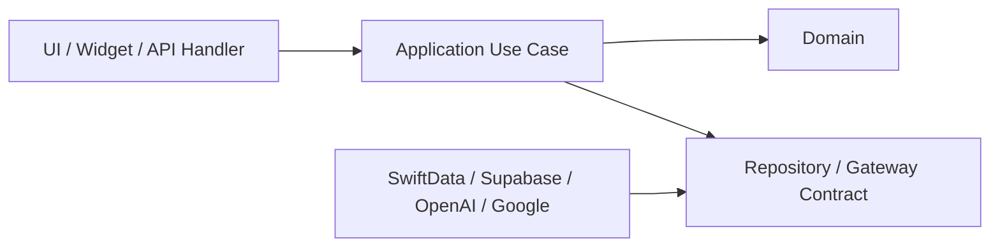

# 엔지니어링·코딩·커밋 규칙

> 제품 언어: [공통 용어집](./11-glossary-and-canonical-rules.md)  
> 기술 구조: [기술 설계](./03-technical-architecture.md)  
> 문서 변경: [문서 운영 규칙](./13-document-governance.md)

## 1. 기본 원칙

- 기능은 PRD ID에서 시작한다.
- 도메인 용어는 용어집과 동일하게 쓴다.
- 같은 검증을 앱·서버 여러 곳에 복사하지 말고 공통 경계에 둔다.
- 개인정보, 입력 검증, 오류 처리, 접근성은 생략하지 않는다.
- 외부 API와 DB 트랜잭션을 섞지 않는다.
- 추측성 추상화와 사용하지 않는 확장 포인트를 만들지 않는다.

## 2. 저장소 구조

```text
apps/
  ios/
  approval-web/
services/
  mcp/
supabase/
  functions/
  migrations/
docs/
  product/
tests/
```

초기에는 별도 패키지와 모노레포 도구를 추가하지 않는다.

## 3. Swift 규칙

### 이름

- 타입: `UpperCamelCase`
- 함수·변수: `lowerCamelCase`
- Bool: `is`, `has`, `can`, `should`
- 화면: `TodayView`, `DailyReviewView`
- 상태 모델: `TodayViewState`
- 시스템 경계: `EventKitCalendarGateway`

### 구조

- SwiftUI View는 표시와 사용자 이벤트 전달에 집중한다.
- 네트워크 호출과 DB 동기화를 View body에 넣지 않는다.
- `AppRouter` 한 곳에서 딥링크를 처리한다.
- SwiftData 모델과 API DTO를 동일 타입으로 강제하지 않는다.
- Widget은 App Group 스냅샷만 읽는다.

### SwiftUI 화면·컴포넌트 경계

- 최상위 페이지는 `*View.swift` 파일 하나를 갖고 상태 소유와 화면 조정만 담당한다.
- 페이지의 독립적인 섹션은 작은 `View` 타입으로 분리하고 값·`Binding`·콜백만 명시적으로 전달한다.
- 화면 파일이 300줄을 넘거나 서로 다른 페이지를 포함하면 파일 분리를 검토한다.
- 로컬 `@State`를 그대로 복제하는 ViewModel은 만들지 않는다. 공유 데이터는 `@Environment`, 페이지 상태는 `@State`를 기본으로 한다.
- 공통 컴포넌트는 두 화면 이상에서 같은 책임으로 반복될 때만 `MemdoComponents.swift`로 올린다.
- 버튼의 행동은 상태 소유 화면에 두고, 반복되는 라벨·터치 영역·선택 표현만 공통 컴포넌트로 재사용한다.
- 툴바, Form, List, Toggle, Picker와 기본 버튼 스타일은 SwiftUI 네이티브 구현을 우선한다.
- Xcode 프로젝트 파일을 직접 추가하지 않는다. `project.yml`을 수정하고 `xcodegen generate`로 재생성한다.

### 동시성

- 새 비동기 코드는 async/await를 사용한다.
- UI 상태 변경은 MainActor에서 수행한다.
- 무분별한 detached task를 만들지 않는다.
- 취소 가능한 작업은 취소를 전파한다.

## 4. 서버 TypeScript 규칙

기준 언어와 런타임은 TypeScript 5.x와 Deno-compatible Supabase Edge Runtime이다. 승인 웹과 MCP도 TypeScript를 사용해 서버 쪽 언어를 하나로 유지한다.

- 파일과 변수: `camelCase`
- DB 테이블·컬럼: `snake_case`
- 타입과 클래스: `PascalCase`
- 상수: 실제 불변 환경 상수만 `UPPER_SNAKE_CASE`
- Edge Function 경로는 리소스 단위 kebab-case

```text
daily-review
plan-drafts
schedule-rules
```

- 외부 입력은 함수 진입점에서 검증한다.
- 검증 후 도메인 함수를 호출한다.
- 응답 DTO에서 DB 내부 필드를 직접 노출하지 않는다.
- 공급자 SDK 오류를 정규 오류 코드로 변환한다.

### DTO와 application 경계

- Request DTO는 HTTP 입력 모양이며 zod 검증 직후 domain command 입력으로 변환한다.
- Response DTO는 공개 필드만 포함하고 DB row, embedding, provider payload를 그대로 반환하지 않는다.
- DB row mapper는 `snake_case ↔ camelCase` 변환만 하며 상태 전이를 판단하지 않는다.
- command/query 함수는 인증된 actor, 검증된 입력, repository/client를 받아 한 사용자 작업을 수행한다.
- SQL migration이 schema의 원본이다. ORM schema generator와 migration을 동시에 운영하지 않는다.
- DTO class 상속, 범용 `BaseDTO`, `BaseRepository`, `Utils` 파일을 만들지 않는다.
- 같은 mapping이나 validation이 두 handler에서 반복될 때 `_shared`로 이동한다.

예상 서버 흐름:

```text
handler → zod request DTO → command/query → Supabase/SQL RPC → response DTO
```

## 5. SQL 규칙

- 식별자는 소문자 snake_case
- 모든 테이블에 명시적 기본 키
- 모든 외래 키는 관계 삭제 정책 명시
- 사용자 테이블은 RLS 활성화
- 마이그레이션은 앞으로만 진행
- 이미 공유된 마이그레이션 파일을 수정하지 않음
- 인덱스 이름: `<table>_<columns>_<purpose>_idx`
- unique 인덱스: `_uidx`
- 제약: `<table>_<meaning>_check|key|fkey`

## 6. API 규칙

- URL은 복수 명사
- 동작이 상태 변경 의미를 가질 때만 하위 액션 사용
- 날짜는 `YYYY-MM-DD`
- 절대 시각은 오프셋 포함 ISO 8601
- 목록은 cursor 기반
- 생성·상태 변경은 `Idempotency-Key`
- 오류는 안정적인 code, 사용자 메시지, retryable을 제공

```json
{
  "error": {
    "code": "INTEGRATION_TIMEOUT",
    "message": "잠시 후 다시 시도해 주세요.",
    "retryable": true,
    "requestId": "uuid"
  }
}
```

## 7. 테스트 규칙

- 비 trivial 분기에는 최소 하나의 실행 가능한 테스트를 둔다.
- 상태 전이는 테이블 기반 테스트를 우선한다.
- 외부 API는 계약 어댑터 경계에서 가짜 응답으로 테스트한다.
- 날짜 테스트는 고정 `Clock`을 사용한다.
- 실제 기기에서만 검증 가능한 위젯·알림은 출시 체크리스트에 증거를 남긴다.
- 테스트 이름은 조건과 결과를 표현한다.

```text
dailyReview_excludesCompletedTodos
rescheduleTomorrow_createsLinkedTodo
planDraft_withoutConsent_isRejected
```

## 8. 로그 규칙

포함:

- request ID
- user ID의 비가역 해시 또는 내부 ID
- 작업 종류
- 결과와 지연
- 공급자 request ID

제외:

- Todo 제목과 메모
- AI 프롬프트 원문
- 인증 토큰
- APNs device token
- 이메일

## 9. 브랜치 규칙

```text
feat/PRD-004-daily-review-settings
fix/PRD-010-widget-deep-link
docs/ADR-010-data-pipeline
chore/db-index-audit
```

장기 develop 브랜치를 두지 않는다. 짧은 브랜치에서 기본 브랜치로 PR한다.

## 10. 커밋 규칙

Conventional Commits 형식을 사용한다.

```text
feat(review): add explicit incomplete-todo responses
fix(widget): preserve todo deep link after unlock
docs(data): define initial index budget
test(sync): cover cursor tie-breaking by id
chore(db): add review response uniqueness constraint
```

허용 타입:

```text
feat fix docs test refactor perf chore build ci
```

커밋 원칙:

- 하나의 논리적 변경만 포함
- 컴파일 또는 문서 검증이 가능한 상태
- DB 스키마 변경과 해당 코드·테스트를 같은 PR에 포함
- 포맷 변경과 기능 변경을 가능한 분리
- 비밀, 개인 데이터, 로컬 설정 파일 커밋 금지
- 생성 파일은 재생성 방법이 없을 때만 커밋

## 11. 커밋 본문

결정 이유가 제목만으로 불명확할 때 작성한다.

```text
feat(review): support rescheduling incomplete todos

PRD: PRD-007
Creates a new todo and marks the original as rescheduled.
The recurrence rule remains unchanged.
```

## 12. Pull Request 규칙

PR에 포함:

- 연결된 PRD·ADR
- 사용자 영향
- 데이터·개인정보 영향
- 마이그레이션과 롤백 또는 forward-fix 방법
- 실행한 테스트
- UI 변경 스크린샷
- 위젯·알림은 실제 기기 증거

권장 크기:

- 리뷰 가능한 하나의 기능 단위
- 500 변경 라인을 지속적으로 넘으면 분리 검토
- 생성 파일과 마이그레이션은 라인 수 판단에서 별도 표기

## 13. 완료 정의

```text
문서 연결
+ 구현
+ 입력 검증
+ 권한·RLS
+ 오류 처리
+ 최소 테스트
+ 관찰 가능성
+ 문서·OpenAPI 갱신
```

## 14. 객체지향과 책임 분리

SOLID는 클래스 수를 늘리는 목표가 아니라 변경 이유와 의존성 방향을 통제하는 기준으로 사용한다.

### 책임 기준

- 타입 하나는 주된 변경 이유 하나만 가진다.
- View는 렌더링과 사용자 이벤트 전달만 담당한다.
- 화면 상태 객체는 로딩·성공·빈 상태·오류 상태와 사용자 액션 조정을 담당한다.
- 도메인 함수와 도메인 객체는 일정 상태 전이와 불변 조건을 담당한다.
- Repository는 저장·조회 계약만 담당하며 화면 정책을 판단하지 않는다.
- Gateway는 OpenAI, Google Calendar, EventKit, APNs 같은 외부 시스템 변환을 담당한다.
- API handler는 인증, 입력 검증, 도메인 호출, 응답 변환까지만 수행한다.
- DB transaction 함수는 원자적으로 바뀌어야 하는 데이터만 다룬다.

한 타입을 수정해야 하는 이유가 UI 변경, DB 변경, 외부 공급자 변경처럼 둘 이상이면 분리를 검토한다. 단순 DTO나 값 객체를 책임 하나마다 다시 감싸지는 않는다.

### 의존성 방향



허용:

```text
UI → Application → Domain
Infrastructure → Application이 정의한 경계
```

금지:

```text
Domain → SwiftUI
Domain → SwiftData
Domain → Supabase SDK
Domain → OpenAI 또는 Google SDK
View → DB 또는 외부 API 직접 호출
```

### 추상화 기준

- 교체 가능한 구현, 외부 시스템 경계, 테스트 대역이 실제로 필요한 곳에만 Swift `protocol` 또는 TypeScript 구조적 계약을 둔다.
- 구현이 하나뿐이고 교체·테스트 경계도 아닌 타입에는 interface, factory, DI container를 만들지 않는다.
- 상속보다 작은 값 타입과 합성을 우선한다.
- 전역 service locator와 singleton으로 의존성을 숨기지 않는다.
- 의존성은 initializer 또는 함수 인자로 명시한다.
- use case가 단순한 한 줄 위임이면 별도 클래스를 만들지 않는다.

### 함수와 파일의 크기 신호

다음은 자동 실패 기준이 아니라 리뷰에서 분리를 질문할 신호다.

- 함수 이름에 `and`가 필요함
- 한 함수가 검증, 외부 호출, DB 쓰기, 응답 변환을 모두 수행함
- 타입이 서로 무관한 세 개 이상의 의존성을 가짐
- 동일 조건문이나 상태 전이 규칙이 두 위치 이상에 복사됨
- 파일을 수정할 때 관련 없는 테스트까지 반복적으로 깨짐

분리 후에도 도메인 규칙의 정답은 한 곳이어야 한다.

## 15. 주석과 문서화 규칙

주석은 코드가 하는 일을 번역하지 않고, 코드만으로 알 수 없는 이유·제약·위험을 기록한다.

### 반드시 남기는 주석

- 개인정보 또는 보안상 필드를 제외하는 이유
- 외부 API의 비정상 동작이나 우회 처리
- 트랜잭션 경계와 잠금 순서의 이유
- 날짜·타임존·반복 일정의 비직관적 불변 조건
- 위젯, App Intent, 백그라운드 실행의 플랫폼 제약
- 성능상 의도적으로 단순 구현을 선택한 경우의 한계와 전환 조건
- 공개되거나 여러 모듈에서 쓰는 API의 계약과 오류 조건

예:

```swift
// Widget은 잠금화면에서 네트워크 완료를 기다릴 수 없으므로
// 앱이 원자적으로 교체한 App Group snapshot만 읽는다.
```

```ts
// 외부 호출을 transaction 밖에서 끝낸 뒤 provider_event_id의
// unique constraint로 재진입을 멱등 처리한다.
```

### 금지하는 주석

```swift
// 완료로 설정
todo.status = .completed
```

- 코드와 같은 내용을 반복하는 주석
- 변경 이력; Git과 ADR이 담당한다.
- 작성자 이름이나 개인 메모
- 실제 동작과 맞지 않는 오래된 주석
- 설명 없는 `TODO`, `FIXME`
- 함수 전체를 주석 처리한 죽은 코드

보류 작업은 다음 형식만 허용한다.

```text
TODO(PRD-123): 이유와 제거 조건
FIXME(issue-456): 현재 위험과 수정 범위
```

주석이 없으면 이해하기 어려운 코드가 이름 변경이나 함수 분리로 명확해질 수 있는지 먼저 확인한다. 리뷰 중 동작이 바뀌면 관련 주석과 문서도 같은 PR에서 수정한다.

## 16. 코드 리뷰 체크리스트

리뷰어는 취향보다 계약과 위험을 확인한다.

### 책임과 구조

- 변경이 PRD·ADR 범위 안에 있는가
- UI, 도메인, 저장소, 외부 공급자 책임이 섞이지 않았는가
- 의존성이 UI에서 도메인 방향으로 흐르는가
- 실제 필요 없는 protocol, wrapper, factory가 추가되지 않았는가
- 기존 공통 경계로 해결할 로직이 복사되지 않았는가

### 정확성과 데이터

- 상태 전이와 불변 조건이 데이터 모델과 일치하는가
- 트랜잭션 범위가 문서와 일치하는가
- 재시도 가능한 쓰기가 멱등한가
- 동시 수정이 `version`과 409로 처리되는가
- 타임존, DST, 반복 일정 경계 테스트가 있는가

### 보안과 개인정보

- 서버 입력 검증과 RLS가 모두 적용되는가
- 동의 범위보다 많은 데이터를 AI나 외부 API에 보내지 않는가
- 로그·주석·fixture·스크린샷에 개인정보나 비밀이 없는가
- 승인 없는 Agent 쓰기가 가능한 경로가 생기지 않았는가

### 유지보수성과 검증

- 이름만으로 역할과 단위가 드러나는가
- 주석이 이유·제약을 설명하며 현재 코드와 일치하는가
- 실패 경로와 사용자 복구 방법이 있는가
- 비 trivial 분기 테스트와 실행 결과가 PR에 있는가
- OpenAPI, migration, 관련 문서가 함께 변경되었는가

중대한 계약·보안·데이터 손실 문제는 승인 차단 사유다. 이름이나 스타일 선호는 formatter 또는 후속 제안으로 처리하며 PR을 불필요하게 막지 않는다.

## 17. 글로벌화 규칙

- Swift 사용자 문구는 `Localizable.xcstrings`에서 관리하고 enum raw value에 한국어를 저장하지 않는다.
- API·DB enum, metric, log event는 안정적인 영문 code를 사용한다.
- 화면 날짜·시간·숫자는 `FormatStyle`과 사용자 locale/calendar/timezone으로 표시한다.
- 서버는 절대 시각을 offset 포함 ISO 8601, 현지 날짜를 `YYYY-MM-DD`, timezone을 IANA ID로 받는다.
- 검색 입력은 Unicode NFC와 공백을 정규화하되 사용자가 입력한 원문은 변경하지 않는다.
- Agent에는 응답 locale과 timezone을 명시하고 JSON field·enum은 번역하지 않는다.
- 날짜·반복·알림 PR은 `ko-KR/Asia-Seoul`과 `en-US/America-Los_Angeles`를 최소 검증한다.

## 18. 성능과 관찰 완료 조건

조회·동기화·외부 호출을 추가하는 PR에는 다음 중 해당 증거가 있어야 한다.

```text
대표 SQL의 EXPLAIN (ANALYZE, BUFFERS)
route p95와 response bytes
cursor/limit 상한
metric·log event·request ID
실패와 재시도 경로
```

인덱스는 실제 query shape와 함께 추가한다. payload 최적화는 projection DTO, delta cursor, ETag, 압축, batch로 해결하며 인덱스로 해결했다고 기록하지 않는다.

코드 경로 규칙:

- 목록에서 행마다 추가 query나 외부 호출을 만드는 N+1을 금지한다.
- DB는 `select *` 대신 공개 DTO에 필요한 열만 조회한다. 단, 단일 상세 command의 반환처럼 모든 공개 필드가 필요한 경우는 허용한다.
- 서로 독립적인 외부 조회는 공급자 rate limit 안에서 병렬화하고, 같은 리소스 쓰기는 순서를 유지한다.
- 날짜 formatter, JSON decoder, 정규식처럼 반복 생성 비용이 확인되는 값은 안전한 범위에서 재사용한다.
- iOS main actor에서 JSON 변환, 대량 sync merge, embedding 처리를 하지 않는다.
- 캐시나 메모이제이션은 측정된 병목과 무효화 규칙이 모두 있을 때만 추가한다.
- 성능 개선 PR은 전후 수치가 없으면 `perf`가 아니라 일반 refactor로 분류한다.
