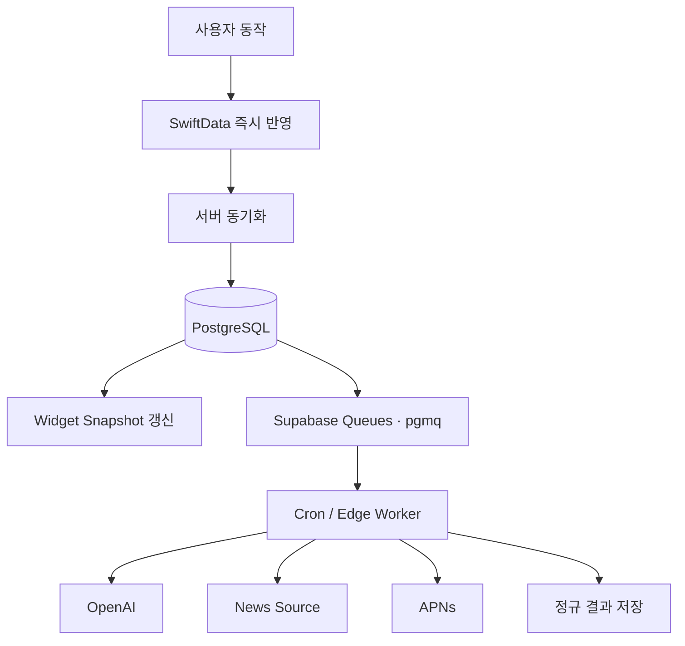

# 데이터 파이프라인 설계

> DB 큐·인덱스: [DB 성능·운영](./14-database-performance-and-operations.md)  
> 공급자 경계: [외부 API 통합](./15-external-integrations-and-naming.md)  
> 개인정보: [개인정보·동의·AI 정책](./06-privacy-consent-ai-policy.md)

## 1. 원칙

- 50명 규모에는 Supabase Queues(`pgmq`)와 Cron이면 충분하다.
- Kafka·RabbitMQ·별도 워커 클러스터를 도입하지 않는다.
- Redis는 queue나 원본 데이터 저장소가 아니라 AI·MCP의 만료 상태에만 사용한다.
- 사용자 요청의 핵심 쓰기는 동기 처리한다.
- 느리거나 재시도 가능한 외부 호출은 작업으로 분리한다.
- 작업은 멱등해야 하며 최소 한 번 실행돼도 결과가 중복되지 않아야 한다.

## 2. 파이프라인 종류



## 3. Queue와 사용자 표시 operation

pgmq가 전달, visibility timeout, 재전달, archive를 담당한다. 모든 내부 job을 별도 업무 테이블에 복제하지 않는다.

```text
queue name
message id
job type
deduplication key
actor user id 또는 system
target id
attempt
trace context
최소 payload
```

사용자에게 진행 상태를 보여줘야 하는 export, account deletion, calendar sync, briefing generation만 `async_operations` 행을 만든다. `GET /operations/{id}`는 이 행을 조회하며 pgmq 내부 metadata를 노출하지 않는다.

```text
async_operations
- id
- user_id
- operation_type
- status: pending|processing|succeeded|failed|cancelled
- result_resource_url?
- error_code?
- created_at
- started_at?
- completed_at?
```

도메인 결과와 operation 상태가 함께 바뀌어야 하면 같은 짧은 DB transaction으로 저장한다. queue 전달은 at-least-once로 보고 도메인 unique constraint와 deduplication key로 중복 실행을 안전하게 만든다.

## 4. 작업 네이밍

```text
generate_plan_draft
generate_daily_briefing
refresh_recurrence_window
send_push_notification
purge_expired_drafts
purge_soft_deleted_todos
sync_external_calendar
```

공급자 이름은 job type에 넣지 않는다. 공급자는 어댑터 설정으로 결정한다.

## 5. 작업 획득

worker는 pgmq read의 visibility timeout으로 한 message를 획득한다.

```text
read + visibility timeout
→ 필요한 operation만 processing 전환
→ 외부 API 호출
→ 짧은 트랜잭션에서 결과 저장
→ 성공 message archive/delete
```

외부 호출 동안 DB lock을 잡지 않는다.

초기에는 Cron이 한 번에 최대 20개 message를 처리한다. 실패하면 attempt와 error code를 기록하고 지수 backoff 후 다시 보낸다. 외부 호출 동안 DB transaction을 유지하지 않는다.

## 6. 일정 동기화 파이프라인

### 업로드

```text
로컬 변경 생성
→ syncState=pending
→ 최대 100개 배치 전송
→ 서버 upsert
→ 서버 버전 반환
→ 로컬 syncState=synced
```

### 다운로드

```text
lastCursor=(updatedAt,id)
→ GET /sync?cursor=...
→ 최대 200개
→ 로컬 트랜잭션 적용
→ nextCursor 저장
→ 위젯 스냅샷 재생성
```

동률 `updatedAt` 누락을 막기 위해 cursor에 ID를 포함한다.

## 7. 반복 일정 파이프라인

```text
매시간 활성 규칙 조회
→ 각 규칙의 생성 완료 날짜 확인
→ 앞으로 30일까지 부족한 occurrence 계산
→ 최대 500행 batch insert
→ unique 충돌은 무시
→ 관련 사용자의 스냅샷 갱신 신호
```

동일 사용자의 규칙 작업 중복을 막기 위해 deduplication key를 사용한다.

```text
recurrence:{ruleId}:{windowEndDate}
```

## 8. 하루 요약 파이프라인

하루 요약 질문 생성에는 AI나 서버 작업이 필요 없다.

```text
사용자가 정한 로컬 시각
→ iOS 로컬 알림
→ 앱이 오늘 미완료 Todo 조회
→ 사용자 응답
→ Todo 상태 + ReviewResponse 원자적 저장
→ 서버 동기화
```

서버는 설정 동기화와 다른 기기의 상태 갱신만 담당한다.

## 9. AI 계획 초안 파이프라인

```text
동의 검증
→ 입력 정규화
→ 허용된 일정 필드만 조회
→ generate_plan_draft 작업 생성 또는 동기 요청
→ OpenAI 구조화 출력 검증
→ PlanDraft 24시간 저장
→ 사용자에게 표시
→ commit 요청 시 Todo 트랜잭션 생성
```

초기 UX는 응답을 기다려야 하므로 동기 HTTP를 사용한다. 15초를 넘기면 작업 ID를 반환하고 폴링으로 전환할 수 있다. 처음부터 스트리밍 인프라는 만들지 않는다.

## 10. 뉴스 파이프라인


최적화:

- 같은 정규 키워드 검색 결과는 30분 내 재사용
- 기사 URL은 전체 사용자 간 중복 제거
- AI 요약은 최종 후보만 수행
- 사용자 50명의 키워드를 개별 호출하지 않고 동일 정규 쿼리를 그룹화
- 브리핑 생성 실패 시 기존 최신 브리핑 유지
- 자동 생성은 사용자 `localTime + days + timezone`으로 작업을 만들고 `(user_id, briefing_date)` unique로 현지 날짜당 한 번만 저장
- 조용한 시간과 겹치면 다음 허용 시각으로 이동

## 10.1 Sync push 결과

각 mutation을 짧은 개별 트랜잭션으로 처리한다.

```text
baseVersion == 0 + row 없음 → insert
baseVersion == current version → update/delete, version + 1
baseVersion 불일치 → conflict + current serverData
검증·권한 실패 → rejected + error
```

배치 일부 충돌은 다른 mutation을 롤백하지 않는다. 동일 `mutationId` 재전송은 원래 결과를 반환한다. 사용자 콘텐츠 유사도를 이용한 자동 중복 제거는 하지 않는다.

## 11. 실패와 재시도

```text
attempt 1: 즉시
attempt 2: 약 30초 후
attempt 3: 약 2분 후
attempt 4: 약 10분 후
```

jitter를 추가한다.

영구 실패:

- 동의 없음
- 잘못된 입력
- 인증 취소
- 존재하지 않는 리소스

일시 실패:

- timeout
- 429
- 5xx
- 네트워크 오류

최대 시도 후 `failed`로 전환하고 사용자 핵심 일정 기능은 계속 동작한다.

## 12. 데이터 관찰

메트릭:

```text
queue_depth
queue_oldest_message_age
job_retry_total
job_failure_rate
external_api_latency
external_api_error_rate
sync_batch_size
sync_conflict_count
briefing_articles_fetched
briefing_articles_summarized
```

로그는 request ID, job ID, provider request ID로 연결한다.

## 13. 확장 조건

다음 중 하나가 실제로 발생할 때 외부 broker를 검토한다.

- pending 작업 10,000개 초과
- 가장 오래된 작업 대기 5분 초과가 반복
- pgmq workload가 사용자 조회 p95에 영향
- 외부 작업량이 초당 수십 건 이상 지속

그 전에는 pgmq를 유지한다.

## 14. 데이터 송신 예산

| 경로 | 상한·최적화 | 지표 |
|---|---|---|
| Todo 목록 | 50개 cursor page, 화면 필드 projection | response bytes/item |
| Sync pull | 200개 delta + 최소 tombstone | bytes/mutation, lag |
| Sync push | 100개 mutation batch, body 256KB | rejected batch, bytes |
| Day view | ETag, 변경 없으면 304 | 304 ratio |
| Briefing | ETag, 기사 원문 미포함 | response bytes |
| MCP tool | 최대 20개 결과, note preview만 | tool bytes, duration |

provider 원본 응답, embedding vector, prompt 원문, audit detail은 client payload에 포함하지 않는다.
