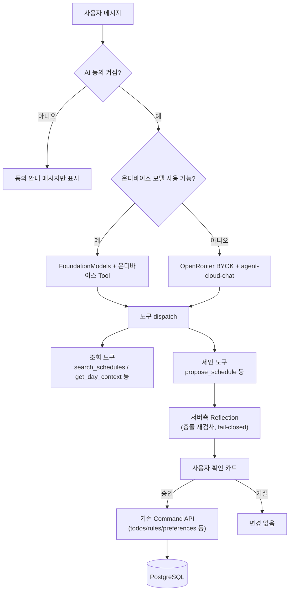

# AI Agent 구성과 운영 구조

> 제품 정책: [개인정보·동의·AI 정책](./06-privacy-consent-ai-policy.md)  
> 일정 검색: [검색 파이프라인](./18-todo-search-pipeline.md)  
> 트랜잭션: [트랜잭션 경계](./19-transaction-boundaries.md)  
> 외부 통합: [외부 API 통합](./15-external-integrations-and-naming.md)

> **개정(2026-08-22)**: 이 문서는 [ADR-073](./10-decisions-and-open-questions.md)이 대체한
> `OpenAI Responses API + 서버 오케스트레이션` 단일 경로 설계를 실제 구현(온디바이스
> FoundationModels + 사용자 BYOK OpenRouter 2트랙) 기준으로 다시 썼다. 1·2·5·5-1·8·9·10·11·12·13·14절과
> 15절의 "Model registry"는 `apps/ios/Memdo/Memdo/AssistantView.swift`·`AgentTools.swift`와
> `memdo-backend/supabase/functions/agent-cloud-chat`·`_shared/agent-cloud-contract.ts`를 정답으로
> 삼아 갱신했다. 3·4절과 15절의 나머지 하위 절(의미 검색·Agents SDK·다중 Agent·MCP)은 원래 설계와
> 실제 구현이 여전히 같은 방향이라 유지했다.

## 0. 실제 제공 경로와 비용 경계

1. 지원 기기에서는 Apple FoundationModels를 기본으로 사용한다. 일정 분류·요약·초안처럼 기기 내
   모델에 맞는 작업은 서버 추론비 없이 처리한다.
2. 더 큰 문맥이나 서버 모델이 필요한 사용자는 자신의 OpenRouter 키를 연결한다. 입력은
   `SecureField`와 명시적 시스템 붙여넣기로 제한하고, 앱은 클립보드를 자동으로 읽지 않는다.
3. `.env` 파일 업로드는 지원하지 않는다. 단일 키 연결에 불필요하고 파일 안의 다른 배포·DB 비밀까지
   전송할 위험이 있기 때문이다. 다중 공급자 일괄 연결 수요가 확인될 때만 허용된 키 이름을 기기에서
   파싱하고 원본 파일은 서버에 보내지 않는 방식을 검토한다.
4. 향후 Memdo가 비용을 부담하는 Cloud 플랜을 추가하면 서버 소유 키만 Edge Function에서 사용하고,
   사용자별 월 포함량·요청 속도·일일 비용에 hard cap을 둔다. iOS 안에서 기능이나 디지털 사용량을
   판매하는 결제는 StoreKit 경로를 사용한다. 무제한 무료 플랜과 클라이언트 내 공용 공급자 키는 두지 않는다.

## 1. 선택

Agent는 서버 상시 오케스트레이션 하나가 아니라 **온디바이스/클라우드 2트랙**이다([ADR-073](./10-decisions-and-open-questions.md)).

- **온디바이스**: 지원 기기(iOS 26+)에서는 Apple FoundationModels(`LanguageModelSession`)가 기본 경로다. 서버 비용이 없고, 도구는 Swift `Tool` 프로토콜로 앱 프로세스 안에서 직접 실행된다(`AgentTools.swift`).
- **클라우드**: 온디바이스를 지원하지 않는 기기이거나 사용자가 더 큰 모델을 원할 때, 사용자 자신의 OpenRouter API 키(BYOK)로 `memdo-backend/supabase/functions/agent-cloud-chat`를 거친다. 이 함수는 OpenRouter Chat Completions(OpenAI 호환)를 SSE로 스트리밍하고, 도구 호출을 직접 dispatch한다.

두 경로 모두 Agents SDK나 별도 오케스트레이션 프레임워크를 쓰지 않는다: 온디바이스는 Apple의 `Tool` 루프, 클라우드는 `_shared/agent-cloud-contract.ts`의 tool-name → handler 조회 테이블(`dispatchToolCall`)이 전부다. 도구 집합이 작고(9개 클라우드 + 3개 온디바이스), 다중 Agent나 handoff가 필요한 독립 전문 영역이 아직 없기 때문이다.

두 경로는 **같은 계약을 따로 구현**한다 — 도구 이름과 인자 모양이 최대한 겹치도록 맞춰져 있을 뿐(`propose_schedule`/`proposeSchedule`, `find_free_slots`/`findFreeSlots`, `propose_schedule_update`/`updateSchedule`), 공유 코드는 없다. `get_day_context`/`get_routine_preferences`/`get_review_history`/`propose_routine_update`/`propose_review_actions` 5개는 현재 클라우드 전용이고 온디바이스 대응 도구가 없다(§5).

## 2. 전체 구조



Agent는 조회하고 제안한다. 실제 쓰기는 Agent 전용 API가 아니라 이미 존재하는 일반 Command API(`todos`, `rules`, `preferences` 등)가 사용자 승인 이후에 수행한다 — Agent가 DB에 직접 쓰는 경로는 없다.

## 3. Agent 이름

제품 코드 이름:

```text
MemdoAgent
```

사용자 표시 이름:

```text
Memdo
```

피할 이름:

```text
SuperAgent
OrchestratorAgent
TodoMasterAgent
PersonalAGI
```

## 4. Agent 책임

포함:

- 자연어 일정 검색
- 사용자의 하루 의도 이해
- 일정 초안 제안
- 기존 일정 충돌 설명
- 브리핑 기사 요약
- 모호한 요청에 필요한 최소 확인

제외:

- 완료 여부 추측
- 사용자 승인 없는 쓰기
- DB SQL 생성·실행
- 동의 범위 결정
- 권한 우회
- 외부 토큰 접근
- 장기 자동화 실행

반복 일정 자동 생성은 Agent가 아니라 승인된 `ScheduleRule`과 규칙 엔진의 책임이다.

## 5. 도구 목록

클라우드 9개(`_shared/agent-cloud-contract.ts`의 `AGENT_TOOL_NAMES`/`cloudAgentTools`), 온디바이스 3개(`AgentTools.swift`). 뉴스 브리핑 요약은 별도 Agent 도구가 아니라 온디바이스 요약 파이프라인이다([ADR-074](./10-decisions-and-open-questions.md), §21).

### 조회 도구 (클라우드 전용, 온디바이스는 전체 스냅샷을 이미 메모리에 들고 있어 불필요)

```text
search_schedules        기간 내 일정 검색 -- 클라우드는 이 결과의 id가 있어야 update/delete 제안 가능
get_day_context         하루 완료/미완료 요약 + 그날 회고 존재 여부
get_routine_preferences 하루 시작·정리·뉴스브리핑 시각, 알림 on/off
get_review_history      최근 회고 N개
```

### 조회+제안 도구 (클라우드·온디바이스 양쪽에 존재, 인자 모양을 맞춤)

```text
find_free_slots / findFreeSlots   빈 시간 블록 검색
propose_schedule / proposeSchedule   신규 일정/할 일 제안
propose_schedule_update / updateSchedule   기존 항목 완료/이동/삭제 제안
```

### 제안 도구 (클라우드 전용, 온디바이스 대응 없음 -- 확인 카드도 아직 없음, §5-1)

```text
propose_routine_update    루틴 설정 변경 제안
propose_review_actions    회고 작성/수정 제안
```

### 실제 변경 도구

```text
없음
```

모든 `propose_*`는 제안만 staging하고, 승인 후 앱이 기존 일반 API(`todos`, `rules`, `preferences` 등)를 호출한다.

### Capability matrix

위 분류를 iOS `AgentRuntime.swift`의 `AgentCapability`/`AgentRuntimeKind.capabilities`가 타입으로 고정한다(Epic D-01). Runtime routing의 입력으로 쓰이진 않는다 — 지금은 on-device 가용 여부만으로 라우팅하고(§2), 자연어 intent로 어떤 capability가 필요한지 판단할 결정론적 방법이 아직 없기 때문이다.

| Capability | On-device | Cloud |
| --- | :---: | :---: |
| `proposeSchedule` | ✅ | ✅ |
| `proposeScheduleUpdate` | ✅ | ✅ |
| `freeSlotSearch` | ✅ | ✅ |
| `scheduleSearch` | — | ✅ |
| `dayContext` | — | ✅ |
| `routinePreferences` | — | ✅ |
| `reviewHistory` | — | ✅ |
| `proposeRoutineUpdate` | — | ✅ |
| `proposeReviewActions` | — | ✅ |

## 5-1. LLM Responsibility Boundary v1

LLM은 Agent 그 자체가 아니라 **자연어를 제한된 도구 호출로 바꾸는 확률적 컴포넌트**다. 아래 표가 Memdo에서 LLM과 코드의 책임 경계다. "LLM"으로 표시된 줄도 결과값은 반드시 코드가 재검증한다 — LLM의 판단이 곧 사실로 취급되는 지점은 없어야 한다.

| 문제 | 책임 |
|---|---|
| 자연어 의도 이해, 도구 선택 | LLM |
| 상대적 시간 표현("퇴근하고", "너무 늦지 않게")의 대략적 의미 | LLM |
| `today`/`tomorrow`/`yyyy-MM-dd` 토큰의 실제 날짜 계산 | 코드 (`resolveDate`, `resolveAgentDateToken`) |
| 타임존 계산 | 코드 (`DEFAULT_TIMEZONE_OFFSET_MINUTES`) |
| 기존 일정 조회, 빈 시간 계산, 충돌 검사 | 코드 |
| 인증·동의 범위 | 코드 (`AIConsent.granted`, `withApi`) |
| 도구 인자의 타입·범위·형식 검증 | 코드 |
| DB 쓰기 | 코드 (승인 후 일반 Command API) |
| 제안 내용을 사용자에게 자연스럽게 설명 | LLM |
| 승인 여부 | 사용자 |

**Invalid Model Output 정책(목표)**: 도구 인자가 계약을 벗어나면 그 필드를 조용한 기본값으로 메우지 않고, 명시적으로 실패시키거나(도구 결과에 에러를 돌려줘 모델이 재시도/재질문하게 함) 확인 카드 자체를 띄우지 않는다. `propose_schedule`의 서버측 Reflection이 충돌 조회 실패를 `conflictCheckFailed=true`로 분리해 절대 "충돌 없음"으로 조용히 넘어가지 않는 것이 이미 이 정책을 따르는 예다.

**v1 기준 실제 상태**(2026-08-22 코드 감사, Sprint 1 "Agent Correctness Baseline" 완료 후 갱신):

| 항목 | 상태 |
|---|---|
| `systemPrompt()`의 "오늘"이 `resolveDate`와 다른 타임존 기준을 쓰던 문제 | **해결됨** — `agent-cloud-chat/index.ts`가 이제 `resolveDate('today', today)`를 그대로 사용 |
| `propose_schedule`/`find_free_slots`의 서버측 시간 충돌 재검사 | **이미 정책 준수** — 모델이 `search_schedules`를 먼저 안 불러도 서버가 강제 재검사, 실패 시 fail-closed |
| `find_free_slots`의 JSON 도구 스키마 (`scope`/`windowStart`/`windowEnd`/`durationMinutes`) | **해결됨** — `_shared/agent-tool-contract.ts`의 `findFreeSlotsArgsSchema`가 `scope` enum + `durationMinutes` 15~480 상하한을 실제로 강제(`parseAgentToolCall`이 `dispatchToolCall`의 handler 실행 전에 거부). iOS `FindFreeSlotTool`도 같은 15~480 범위를 clamp 대신 reject로 통일 |
| `propose_schedule`/`propose_schedule_update`의 `date` 필드가 `resolveDate`를 통과 못 하는 임의 문자열일 때 | **해결됨** — `dateExpressionSchema`(`today`/`tomorrow`/실제 존재하는 `yyyy-MM-dd`, `z.iso.date()`)가 `parseAgentToolCall`에서 먼저 검증되므로, `resolveDate`는 이제 이미 유효한 토큰만 받는다 |
| iOS `resolveAgentDateToken`이 파싱 실패한 날짜 토큰을 처리하는 방식 | **해결됨** — 함수 자체를 제거하고 실패 가능한 `AgentDateExpression(token:)`(`AgentIntent.swift`)로 대체. `ProposeScheduleTool`/`UpdateScheduleTool`/`FindFreeSlotTool.call(arguments:)`와 `AssistantView`의 클라우드 응답 스테이징 지점 모두 파싱 실패 시 스테이징하지 않고 설명 문자열만 반환한다. `UpdateScheduleTool.Arguments.action`도 제약 없는 `String`에서 `AgentUpdateAction` enum 검증으로 바뀌었고, `AssistantView`의 `switch action`도 `default: break`가 아니라 명시적 에러 메시지를 남긴다 |
| `propose_routine_update`/`propose_review_actions`의 확인 카드 | **미구현, Sprint 1 범위 밖** — 서버는 정상적으로 제안을 staging해서 `done` payload에 싣지만(§8), iOS `ScheduleAPI.swift`의 Decodable DTO에 해당 필드가 없어 조용히 무시된다. 지금 이 두 도구를 모델이 호출하면 화면에 아무 반응도 없다 |

**v1에서 하지 않은 것**: `propose_routine_update`/`propose_review_actions` 확인 카드, Eval Dataset 구축(§14), 모델 capability 기반 registry(§15), 완전한 `AgentIntent`/`CLARIFICATION_REQUIRED` union(Epic B의 B-03/B-05, `eval/agent-v0/README.md`도 이 라벨들을 "runtime enum 아님"으로 명시). 위 표의 나머지 항목은 Sprint 1(A-01~A-04, B-01/B-02/B-04)에서 실제로 고쳤다 — `memdo-backend`의 `_shared/agent-tool-contract.ts`, `apps/ios/Memdo/Memdo/AgentIntent.swift`가 그 결과물이다.

## 6. 도구 네이밍

모델 도구 이름은 lower snake_case 동사 + 명사 (클라우드), 온디바이스는 Swift 컨벤션에 맞춰 lowerCamelCase로 같은 이름을 미러링한다:

```text
search_schedules
get_day_context
find_free_slots / findFreeSlots
propose_schedule / proposeSchedule
```

도구 설명에는 반드시 다음을 포함한다.

- 사용할 때
- 사용하지 않을 때
- 입력 필드
- 반환 필드
- 최대 결과 수
- 오류 코드
- 개인정보 범위

`execute`, `process`, `handle` 같은 모호한 동사는 사용하지 않는다.

## 7. 실행 흐름 (클라우드 경로 기준)

```text
1. withApi가 사용자 인증 확인 (JWT)
2. AIConsent.granted 확인 -- 꺼져 있으면 tool 호출 없이 안내 메시지만 반환
3. chatRequestSchema로 요청 검증 (message/history/model)
4. rate limit 확인 (RATE_LIMIT_PER_HOUR, agent_chat_requests 테이블)
5. systemPrompt(오늘 날짜) + 대화 history + 사용자 메시지로 구성
6. OpenRouter Chat Completions를 SSE로 스트리밍 호출
7. tool_call 델타를 누적, 완성되면 dispatchToolCall로 즉시 실행
8. propose_* 도구는 서버측 Reflection(충돌 재검사)을 거쳐 상태에 staging
9. MAX_TOOL_ITERATIONS 안에서 반복, 모델이 최종 텍스트를 낼 때까지
10. done 메시지로 staged proposal + 사용량을 클라이언트에 전달
11. 사용자가 확인 카드에서 승인 -- 그제서야 일반 Command API 호출
```

온디바이스 경로는 2~4단계가 없고(로컬 실행, rate limit 무의미) 6~10단계가 Apple `Tool` 프로토콜의 자체 루프로 대체된다. 두 경로 모두 11단계는 동일한 확인 카드 컴포넌트(`ProposedScheduleCard`/`ProposedScheduleUpdateCard`)를 공유한다.

## 8. 출력 타입 (`done` 메시지, `buildDonePayload`)

```text
message              모델의 최종 텍스트
usage                 promptTokens/completionTokens/costUsd
proposedSchedule?             CloudProposedScheduleDTO -- iOS가 디코딩함
proposedScheduleUpdate?       CloudProposedScheduleUpdateDTO -- iOS가 디코딩함
proposedRoutineUpdate?        아직 iOS DTO에 필드가 없어 조용히 무시됨 (§5-1)
proposedReviewAction?         아직 iOS DTO에 필드가 없어 조용히 무시됨 (§5-1)
```

`kind`/`evidence[]`/`appliedScope` 같은 구조화 envelope은 없다 -- 모델의 자연어 응답과 최대 하나의 staged proposal을 함께 반환하는 평평한 구조다. `complete`/`reschedule`/`delete`(propose_schedule_update의 action) 모두 반드시 사용자가 카드에서 승인해야 한다.

## 9. 프롬프트 구조

구조화 envelope(XML 태그) 없이 **평문 지시문 목록**이다(`systemPrompt()`, `_shared/agent-cloud-contract.ts`):

```text
1. 한국어로만 답하라 (locale ko_KR)
2. 어떤 페르소나로 행동하는가
3. 오늘 날짜 (resolveDate('today', ...) 기준)
4~9. 도구별 사용 조건 -- "생성/추가 요청이면 propose_schedule을 불러라, 텍스트로만 설명하지 마라" 형태로 도구 하나당 한 줄
10. "직접 수정 금지, 모든 변경은 propose_* + 사용자 승인을 거쳐야 한다"
```

온디바이스는 별도 메커니즘이다 -- `AgentPrompts.yml`(YAML) + `AgentPrompts.swift`가 컨텍스트별(오늘/캘린더/설정/요약 등) instructions와 빠른 요청 프롬프트를 관리한다. 클라우드 systemPrompt와 텍스트를 공유하지 않는다.

## 10. 실행 제한 (실측치)

```text
MAX_TOOL_ITERATIONS: 5              (agent-cloud-contract.ts)
RATE_LIMIT_PER_HOUR: 30             (사용자당, rolling hour, agent_chat_requests 카운트)
history 최대 turn 수: 40             (chatRequestSchema)
message 최대 길이: 2000자            (chatRequestSchema)
search_schedules/findFreeSlots 결과: limit(200) -- 페이지네이션 없음
```

**미구현**: 전체 요청 timeout, 개별 tool 호출 timeout이 코드에 없다(`agent-cloud-chat/index.ts`에 `AbortController`/timeout 없음) -- Edge Function 플랫폼 자체의 실행 시간 제한에만 의존한다. 한도를 넘었을 때 "부분 결과 + 명확한 실패 이유"를 구조적으로 반환하는 경로도 아직 없다.

## 11. 대화 상태

요청 단위 실행이고, 서버는 대화 상태를 저장하지 않는다.

- `agent-cloud-chat`는 stateless -- 클라이언트(`AssistantView.swift`의 `cloudHistory()`)가 이미 종료된 메시지들을 매번 통째로 재전송한다(최대 40 turn, §10).
- `PlanDraft`처럼 서버에 24시간 유지되는 초안 엔터티는 없다 -- staged proposal은 그 요청의 `done` payload 안에만 존재하고, 승인/거절 전까지 클라이언트 메모리(`AgentScheduleUpdateProposal` 등)에만 산다.
- 사용자 선호는 `get_routine_preferences` 도구로 명시적 preferences 테이블에서 읽는다(원래 설계 그대로).

## 12. Guardrail (실제 구현)

### 입력

- `chatRequestSchema`(Zod)가 message 길이·history 개수/길이·model 값을 검증
- `AIConsent.granted`가 꺼지면 tool dispatch 자체를 타지 않음(§7)
- 날짜·타임존은 요청 검증이 아니라 `resolveDate`/`DEFAULT_TIMEZONE_OFFSET_MINUTES`로 도구 실행 시점에 계산

### 도구

- 인증 사용자 ID는 `context.userClaims`에서 서버가 주입 -- 모델 입력이 아님(원래 설계대로 유지)
- `search_schedules`/`findFreeSlots` 결과는 200건으로 제한
- SQL·URL·토큰을 도구 인자로 받는 도구 없음
- 개별 도구 인자는 `_shared/agent-tool-contract.ts`의 `parseAgentToolCall`이 `dispatchToolCall`의 handler 실행 전에 Zod로 검증(§5-1) -- `cloudAgentTools`의 JSON Schema 자체는 여전히 느슨하지만(모델에게 보여주는 안내일 뿐, 강제력 없음), 실제 강제는 이 Zod 레이어가 한다

### 출력

- `propose_schedule_update`는 존재하지 않는(또는 삭제된) id를 `fetchScheduleById`가 `null`로 걸러 거부
- `propose_schedule`/`propose_schedule_update` 모두 서버가 직접 재조회해 충돌을 검사(모델이 `search_schedules`를 먼저 안 불렀어도 강제) -- 실패 시 "충돌 없음"으로 조용히 넘기지 않고 `conflictCheckFailed`로 분리(fail-closed)
- "허용 범위 밖의 필드 제거"는 Zod 스키마의 기본 strip 동작(정의 안 된 키는 조용히 제거)으로 이미 이루어진다 -- `propose_schedule_update`는 한 걸음 더 나가 `action`별 `.strict()` discriminated union이라 `complete`/`delete`에 `date`/`startTime`이 섞여 오면 필드를 조용히 버리지 않고 아예 `INVALID_AGENT_ARGUMENT`로 거부한다
- 최대 작업 수 5개는 `MAX_TOOL_ITERATIONS`로 반영(§10)

## 13. 감사와 추적 (실제 상태)

실제로 저장하는 것은 `agent_chat_requests(user_id, created_at)` 하나뿐이고, 목적도 rate limit 카운팅이다:

```text
user_id
created_at
```

원래 설계가 그리던 아래 스키마는 **아직 구현되지 않았다** -- model/toolNames/latencyMs/resultKind/providerRequestId 중 어느 것도 기록되지 않는다:

```text
agentRunId
workflowName
model
toolNames
toolCallCount
latencyMs
resultKind
approvalStatus
providerRequestId
```

사용자 메시지 원문·Todo 제목/메모·도구 전체 입출력·모델 응답 원문은 (의도적으로든 결과적으로든) 저장되지 않는다는 점은 원래 설계와 일치한다. 비용/지연/실패 원인을 나중에 분석하려면 이 절의 스키마를 실제로 만드는 작업이 필요하다 -- §14 Eval과 붙여서 진행하는 편이 자연스럽다(같은 이벤트에서 같이 뽑을 수 있는 데이터이므로).

## 14. 평가 (실제 상태)

**자동화된 Eval은 아직 없다.** 있는 것은 두 종류뿐이다:

1. `agent-cloud-contract.test.ts`(81개 중 다수) -- `resolveDate`/`expandScope`/`findConflict`/SSE 파싱 같은 **Agent 주변 deterministic 코드**의 단위 테스트. "도구 호출 로직이 맞는가"이지 "모델이 맞는 도구를 고르는가"가 아니다.
2. [`docs/32-agent-manual-test-plan.md`](./32-agent-manual-test-plan.md) -- 실제 OpenRouter 키(과금)와 실기기 Apple Intelligence가 있어야 실행되는 **수동** 체크리스트.

"프롬프트별 도구 선택 정확도·날짜 해석·인자 유효성"을 반복 가능하게 측정하는 자동 Eval Dataset은 아직 없다. §5-1의 Boundary/Contract가 곧 이 Eval의 입력 스펙이 될 수 있으므로, 정의된 Intent/Contract가 안정된 뒤 Eval Dataset을 만드는 것을 다음 작업으로 권장한다 -- 이번 v1 개정 범위에는 포함하지 않았다.

출시 전 최소 평가셋(목표, 아직 데이터셋 자체는 없음):

- 직접 일정 검색 20개
- 날짜가 모호한 검색 10개
- 계획 생성 20개
- 충돌 일정 10개
- 동의 범위 10개
- 승인 없는 변경 방지 10개
- 한국어 시간 표현 20개

평가 항목:

```text
도구 선택 정확도
날짜 해석
검색 recall
잘못된 Todo ID 비율
미승인 쓰기 시도
동의 범위 위반
응답 지연
토큰 비용
```

## 15. 확장 조건

### Model registry

OpenAI Responses API·llama.cpp 이중 adapter 설계는 ADR-073으로 폐기됐다 -- 서버가 추론비를 부담하는 상시 adapter 계층 자체가 ADR-073이 피하려던 비용 구조다. 지금은 OpenRouter Chat Completions 단일 HTTP API 위에 `ALLOWED_OPENROUTER_MODELS`(고정 배열, `agent-cloud-contract.ts`) 하나로 모델을 제한한다 -- iOS `CloudAgentModelPreference`가 별도로 관리하지 않고 이 배열을 그대로 따른다(`agent-models-contract.ts`).

모델 ID를 architecture 결정으로 다루면(지금처럼 배열에 문자열을 직접 추가/제거) 카탈로그가 바뀔 때마다 코드 변경이 필요하다. §14의 Eval Dataset이 갖춰지면 다음 형태의 **capability + eval 기반 registry**로 옮기는 것을 후보로 둔다:

```text
ModelProfile
  id
  supportsTools
  latencyClass
  costClass
  evalScore   -- §14 Eval Dataset 통과 점수
  enabled
```

그러면 "어떤 모델이 더 똑똑한가"가 아니라 "Memdo Eval을 SLA 안에서 가장 싸게 통과하는 모델은 무엇인가"로 교체 기준이 바뀐다. Eval Dataset이 없는 지금은 이 registry를 만들 근거 데이터가 없으므로 착수하지 않는다.

### 의미 검색

직접 검색은 pg_trgm이 기본이다. 평가셋에서 의미 검색이 필요한 질의를 별도로 정의하고 pgvector가 recall을 개선할 때만 hybrid retrieval을 켠다. 동의하지 않은 note는 embedding하지 않으며 vector query에도 user filter를 먼저 적용한다.

### Agents SDK

다음이 필요할 때:

- 복수 turn의 복잡한 도구 루프
- 중단·승인 후 실행 재개
- 표준 tracing과 guardrail 운영
- 하나 이상의 전문 Agent

### 다중 Agent

다음이 데이터로 확인될 때만:

- 뉴스와 일정 계획이 서로 다른 평가 기준과 도구를 가져 단일 prompt 성능을 저해
- 병렬 전문 작업이 지연을 유의미하게 줄임
- 단일 Agent eval이 지속적으로 실패

### MCP

다음이 필요할 때:

- ChatGPT나 다른 Agent가 Memdo 일정에 접근
- 외부 클라이언트에 표준 도구 계약 제공

앱 내부 Agent가 자체 API를 호출하기 위해 MCP를 추가하지 않는다.

외부 Codex·ChatGPT에 일정을 제공할 때의 도구, OAuth, 제안 응답, 승인 링크 구조는 [Integration Hub](./21-integration-hub-google-calendar-mcp.md)를 따른다.
