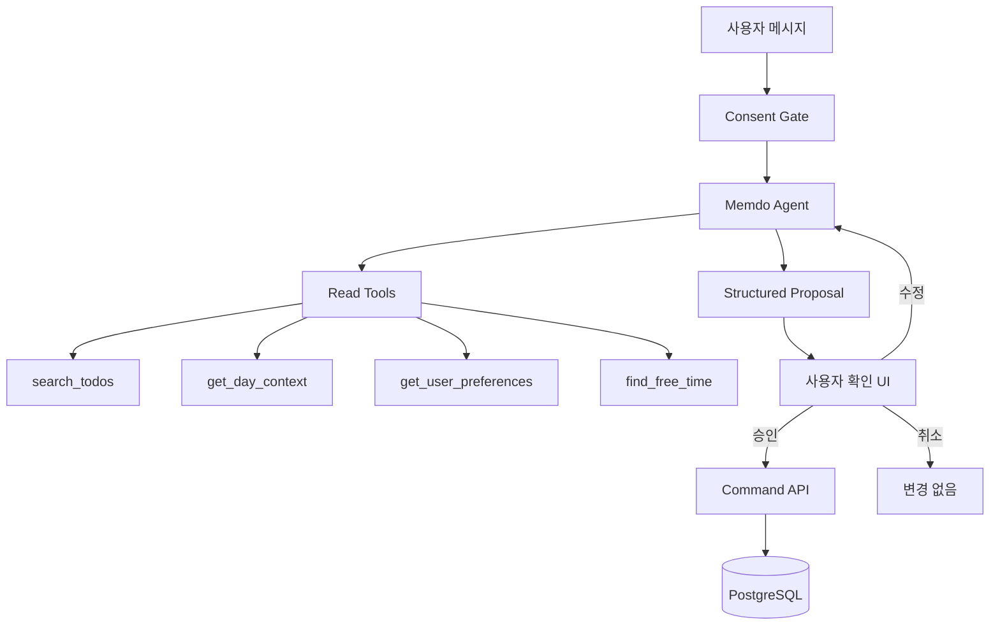

# AI Agent 구성과 운영 구조

> 제품 정책: [개인정보·동의·AI 정책](./06-privacy-consent-ai-policy.md)  
> 일정 검색: [검색 파이프라인](./18-todo-search-pipeline.md)  
> 트랜잭션: [트랜잭션 경계](./19-transaction-boundaries.md)  
> 외부 통합: [외부 API 통합](./15-external-integrations-and-naming.md)

## 1. 선택

MVP는 `OpenAI Responses API + 서버 함수 도구 + 단일 Memdo Agent`를 사용한다.

초기에는 Agents SDK, 다중 Agent, handoff, MCP를 사용하지 않는다.

이유:

- 계획·검색·브리핑이라는 작은 도구 집합
- 사용자가 승인하기 전 쓰기 금지
- Supabase Edge Functions의 TypeScript 실행 환경
- 직접 오케스트레이션이 더 짧고 명시적
- 다중 Agent가 해결할 독립 전문 영역이 아직 없음

Agents SDK는 도구 호출 루프, 세션, guardrail, handoff, tracing 관리가 필요해질 때 도입 후보로 둔다. 공식 문서상 Agents SDK도 OpenAI 모델에 Responses API를 기본 사용하며, SDK는 그 위의 오케스트레이션 계층이다.

## 2. 전체 구조



Agent는 조회하고 제안한다. 실제 쓰기는 Agent 도구가 아니라 승인된 Command API가 수행한다.

## 3. Agent 이름

제품 코드 이름:

```text
MyDayAgent
```

사용자 표시 이름:

```text
Memdo
```

피할 이름:

```text
SuperAgent
OrchestratorAgent
TodoMasterAgent
PersonalAGI
```

## 4. Agent 책임

포함:

- 자연어 일정 검색
- 사용자의 하루 의도 이해
- 일정 초안 제안
- 기존 일정 충돌 설명
- 브리핑 기사 요약
- 모호한 요청에 필요한 최소 확인

제외:

- 완료 여부 추측
- 사용자 승인 없는 쓰기
- DB SQL 생성·실행
- 동의 범위 결정
- 권한 우회
- 외부 토큰 접근
- 장기 자동화 실행

반복 일정 자동 생성은 Agent가 아니라 승인된 `ScheduleRule`과 규칙 엔진의 책임이다.

## 5. 도구 목록

### 조회 도구

```text
search_todos
get_todo
get_day_context
get_user_preferences
find_free_time
get_interest_topics
```

### 외부 정보 도구

```text
search_news
```

뉴스 동의가 있을 때만 활성화한다.

### 제안 도구

별도 DB 쓰기가 아니라 실행 결과의 구조를 만드는 도구:

```text
propose_plan_draft
propose_todo_changes
propose_schedule_rule
```

실제 변경 도구:

```text
없음
```

승인 후 앱이 일반 API를 호출한다.

## 6. 도구 네이밍

모델 도구 이름은 lower snake_case 동사 + 명사:

```text
search_todos
get_day_context
find_free_time
search_news
```

도구 설명에는 반드시 다음을 포함한다.

- 사용할 때
- 사용하지 않을 때
- 입력 필드
- 반환 필드
- 최대 결과 수
- 오류 코드
- 개인정보 범위

`execute`, `process`, `handle` 같은 모호한 동사는 사용하지 않는다.

## 7. 실행 흐름

```text
1. 인증 확인
2. AI 동의와 세부 scope 확인
3. 사용자 입력 검증
4. Agent instructions 구성
5. 허용된 도구만 등록
6. Responses API 실행
7. 도구 호출을 서버 도메인 함수로 처리
8. 최종 structured output 검증
9. PlanDraft 또는 Proposal 저장
10. 사용자 승인 화면
11. 승인 후 일반 Command API 실행
```

## 8. 출력 타입

### AgentResponse

```text
kind:
  answer
  todo_search_results
  plan_draft
  todo_change_proposal
  schedule_rule_proposal
  clarification
  refusal

message
evidence[]
proposal?
appliedScope
```

### TodoChangeProposal

```text
proposalId
expiresAt
summary
operations[]
warnings[]
```

operation:

```text
create
update
reschedule
complete
skip
```

`complete`와 `skip`도 반드시 사용자 확인을 받는다.

## 9. 프롬프트 구조

```text
<role>
개인형 데일리 캘린더의 계획 파트너
</role>

<product_rules>
평가하지 않기
완료 추측 금지
승인 없는 변경 금지
</product_rules>

<privacy_scope>
이번 실행에서 허용된 데이터 필드
</privacy_scope>

<tool_rules>
조회 도구 사용 조건
결과 한도
재호출 제한
</tool_rules>

<output_contract>
정확한 structured output schema
</output_contract>

<stop_conditions>
최대 turn과 모호성 처리
</stop_conditions>
```

## 10. 실행 제한

```text
max model turns: 6
max tool calls: 8
search_todos max results: 20
news candidates before summary: 10
whole request timeout: 20 seconds
tool timeout: 3 seconds internal / 8 seconds external
```

한도를 넘으면 부분 결과와 명확한 실패 이유를 반환한다.

## 11. 대화 상태

MVP 기본은 요청 단위 실행이다.

- 서버에 장기 자유대화 메모리를 만들지 않는다.
- 사용자가 수정 중인 `PlanDraft`만 24시간 유지한다.
- 후속 메시지는 draft ID로 문맥을 연결한다.
- 과거 대화 전체를 매번 모델에 보내지 않는다.
- 사용자 선호는 명시적 preferences 테이블에서 읽는다.

대화형 사용이 핵심으로 검증되면 Responses continuation 또는 Agents SDK session 중 하나를 선택한다. 둘을 중복 적용하지 않는다.

## 12. Guardrail

### 입력

- 최대 길이
- 지원하지 않는 민감 작업 차단
- 동의 범위 확인
- 날짜와 타임존 검증

### 도구

- 인증 사용자 ID는 모델 입력이 아니라 서버 context에서 주입
- 최대 날짜 범위
- 최대 결과 수
- SQL, URL, 토큰을 도구 인자로 받지 않음

### 출력

- JSON Schema 검증
- 존재하지 않는 Todo ID 거부
- 조회하지 않은 Todo에 대한 변경 제안 거부
- 허용 범위 밖의 필드 제거
- 최대 작업 수 5개

## 13. 감사와 추적

저장:

```text
agentRunId
workflowName
model
toolNames
toolCallCount
latencyMs
resultKind
approvalStatus
providerRequestId
```

기본 미저장:

```text
사용자 메시지 원문
Todo 제목·메모
도구 전체 입출력
모델 응답 원문
```

Agents SDK tracing을 도입할 경우 민감 데이터 포함을 비활성화하고, SDK tracing과 자체 `agent_runs`의 책임을 구분한다.

## 14. 평가

출시 전 최소 평가셋:

- 직접 일정 검색 20개
- 날짜가 모호한 검색 10개
- 계획 생성 20개
- 충돌 일정 10개
- 동의 범위 10개
- 승인 없는 변경 방지 10개
- 한국어 시간 표현 20개

평가 항목:

```text
도구 선택 정확도
날짜 해석
검색 recall
잘못된 Todo ID 비율
미승인 쓰기 시도
동의 범위 위반
응답 지연
토큰 비용
```

## 15. 확장 조건

### Agents SDK

다음이 필요할 때:

- 복수 turn의 복잡한 도구 루프
- 중단·승인 후 실행 재개
- 표준 tracing과 guardrail 운영
- 하나 이상의 전문 Agent

### 다중 Agent

다음이 데이터로 확인될 때만:

- 뉴스와 일정 계획이 서로 다른 평가 기준과 도구를 가져 단일 prompt 성능을 저해
- 병렬 전문 작업이 지연을 유의미하게 줄임
- 단일 Agent eval이 지속적으로 실패

### MCP

다음이 필요할 때:

- ChatGPT나 다른 Agent가 Memdo 일정에 접근
- 외부 클라이언트에 표준 도구 계약 제공

앱 내부 Agent가 자체 API를 호출하기 위해 MCP를 추가하지 않는다.

외부 Codex·ChatGPT에 일정을 제공할 때의 도구, OAuth, 제안 응답, 승인 링크 구조는 [Integration Hub](./21-integration-hub-google-calendar-mcp.md)를 따른다.
