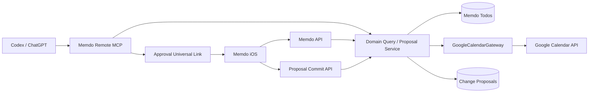
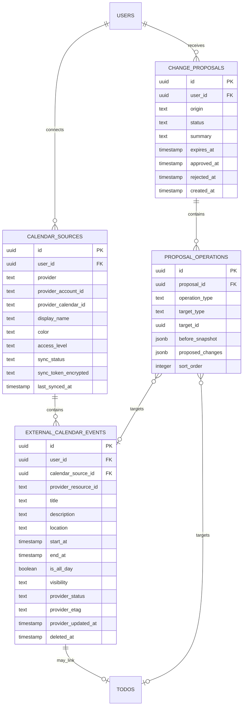

# Integration Hub: Google Calendar·MCP·승인 링크

> 외부 API 원칙: [외부 API 통합](./15-external-integrations-and-naming.md)  
> Agent 승인 구조: [AI Agent 설계](./20-ai-agent-architecture.md)  
> 개인정보: [개인정보·동의·AI 정책](./06-privacy-consent-ai-policy.md)  
> 데이터 파이프라인: [데이터 파이프라인](./17-data-pipeline.md)

> **실제 구현 현황(2026-08-17)**: 14절의 Phase A(Google Calendar read-only, 출처 배지, Today 통합
> 타임라인, 통합 검색)만 실제로 배포했다. 테이블명은 `google_calendar_connections`/
> `google_calendar_mirror_events`로 Google 전용이며(3·6절의 범용 `calendar_sources`/
> `external_calendar_events` 명명과 다름), `change_proposals`/`proposal_operations` 테이블과
> 승인 링크(10~12절), Google Calendar write(Phase B), Memdo Remote MCP(9절, Phase C)는 아직
> 만들지 않았다. Slack(17~18절)은 OAuth 앱 설치 대신 사용자가 발급한 Incoming Webhook URL을
> Keychain에 저장하는 훨씬 축소된 범위로 구현했다 — [ADR-075](./10-decisions-and-open-questions.md)
> 참고. 아래 절은 원래 설계와 향후 확장 시 따를 계약을 남겨 두는 참고 자료로 유지한다.

## 1. 제품 목표

사용자는 Memdo 앱, Google Calendar, Codex·ChatGPT 같은 외부 AI 어디에서 요청하더라도 같은 일정 문맥을 사용하고, 변경 제안을 링크로 확인한 뒤 승인할 수 있다.

예:

```text
Codex:
“내 Google Calendar를 확인해서 내일 집중 시간을 잡아줘.”

Memdo MCP:
Google Calendar와 Memdo 일정을 조회
→ 빈 시간 계산
→ 변경 제안 생성
→ 승인 링크 반환

사용자:
링크 탭
→ Memdo 앱에서 변경 내용 확인
→ 승인
→ Google Calendar 또는 Memdo에 저장
```

## 2. 전체 구조



MCP와 iOS API는 서로 다른 비즈니스 로직을 구현하지 않는다. 둘 다 같은 Query, Proposal, Command 서비스를 사용한다.

## 3. Google Calendar 연결

### OAuth

- 사용자가 Google Calendar 연결을 누를 때만 요청
- 처음에는 read-only scope
- Google Calendar에 쓰기를 활성화할 때 write scope를 추가 요청
- 백그라운드 동기화가 필요하면 offline access 사용
- refresh token은 서버 암호화 저장
- 승인된 실제 scope를 저장하고 기능 활성 여부를 결정

연결 상태:

```text
pending
active
reauthorization_required
revoking
revoked
error
```

### 최소 권한 단계

```text
1. Free/busy only
2. Calendar events read
3. Calendar events write
```

읽기만 필요한 사용자가 쓰기 권한까지 승인하도록 요구하지 않는다.

## 4. Google Calendar 동기화

### 초기 동기화

```text
연결 완료
→ 선택한 캘린더 목록 저장
→ 과거 90일~미래 365일 이벤트 수집
→ external_calendar_events upsert
→ nextSyncToken 저장
```

### 증분 동기화

```text
syncToken으로 변경분 요청
→ pagination 처리
→ 삭제 이벤트 포함 upsert/tombstone
→ 마지막 페이지의 nextSyncToken 저장
```

Google이 sync token에 `410 Gone`을 반환하면 해당 calendar source의 미러 데이터를 지우고 전체 동기화한다.

### 알림

Google push notification은 “변경이 있다”는 신호로만 사용한다. 알림 본문을 데이터로 신뢰하지 않고 증분 동기화를 실행한다.

## 5. 원본과 내 일정 분리

Google 이벤트를 Memdo Todo 테이블에 그대로 복사하지 않는다.

```text
todos
  Memdo에서 행동으로 관리하는 일정

external_calendar_events
  Google·Apple 등 외부 캘린더 미러
```

사용자가 Google 이벤트를 Memdo 행동으로 전환하면 연결만 만든다.

```text
Todo.linkedExternalEventId
```

원본 이벤트 제목·시간과 Todo 완료 상태는 서로 다른 책임이다.

## 6. 통합 ERD



## 7. UI 인덱싱

UI에서 “인덱싱”은 출처와 의미를 안정적으로 분류해 검색·필터·배지에 사용하는 것을 뜻한다.

### 두 축

```text
entryKind:
  event
  task
  external_event
  proposal

sourceProvider:
  memdo
  google_calendar
  apple_eventkit
  mcp
```

`mcp`는 일정의 실제 원본이 아니라 제안 유입 경로다. MCP 제안을 승인해 Memdo Todo가 생성되면:

```text
sourceProvider = memdo
origin = mcp
```

### 소유 형태

```text
ownership:
  owned
  mirrored
  proposed
```

### UI 표시

| 종류 | 기본 배지 | 편집 |
|---|---|---|
| Memdo Todo | 내 일정 | 앱에서 수정 |
| Google event | Google · 캘린더 이름 | Google 권한에 따라 |
| Apple event | Apple Calendar | EventKit 권한에 따라 |
| MCP proposal | AI 제안 | 승인 전 편집 가능 |

배지는 색상만 쓰지 않고 텍스트와 아이콘을 함께 사용한다.

### Today 통합 타임라인

별도 조회 테이블을 만들지 않고 Query Service가 두 소스를 병합한다.

```text
TodoRepository.listDay()
+ ExternalCalendarRepository.listDay()
→ CalendarEntryMapper
→ startAt, sortOrder 기준 병합
→ UnifiedDayTimeline
```

50명 규모에서는 PostgreSQL view 또는 두 쿼리의 애플리케이션 병합으로 충분하다. materialized view는 사용하지 않는다.

### 필터

```text
전체
내 일정
Google Calendar
Apple Calendar
AI 제안
캘린더별
```

선택 상태는 `UserPreferences.calendarFilter`에 저장한다.

## 8. 통합 검색

사용자가 “지난주 Google 회의”를 검색할 수 있도록 검색 범위를 지정한다.

```text
scope:
  memdo
  external_calendars
  all
```

Agent 도구:

```text
search_calendar_entries(
  query?,
  from?,
  to?,
  source_providers?,
  calendar_source_ids?,
  entry_kinds?,
  statuses?
)
```

반환 결과에는 항상:

```text
entryId
entryKind
sourceProvider
sourceLabel
title
startAt
endAt
ownership
resourceUrl
```

## 9. Memdo MCP

### 전송

- 공개 HTTPS
- Streamable HTTP
- 사용자 OAuth
- 사용자와 tenant ID는 인증 context에서 주입
- 도구 인자로 user ID를 받지 않음

### 조회 도구

```text
search_calendar_entries
get_day_context
get_calendar_sources
get_todo
get_change_proposal
```

### 제안 도구

```text
propose_todo_create
propose_todo_update
propose_todo_reschedule
propose_google_event_create
propose_google_event_update
```

### 실행 도구

MVP에서는 외부 AI에 직접 실행 도구를 제공하지 않는다.

```text
commit_change_proposal  // 제공하지 않음
delete_calendar_event   // 제공하지 않음
```

승인은 Memdo 앱 또는 승인 웹 화면에서 수행한다.

## 10. MCP 응답 링크

제안 도구 응답은 text와 structured content를 함께 제공한다.

```json
{
  "proposalId": "uuid",
  "status": "pending_approval",
  "summary": "내일 14:00–15:30 집중 시간을 추가합니다.",
  "approvalUrl": "https://memdo.example/proposals/uuid",
  "resourceUrl": "https://memdo.example/todos/uuid",
  "expiresAt": "2026-08-01T12:00:00Z"
}
```

text:

```text
일정 변경 제안을 만들었습니다.
검토하고 승인하기: https://memdo.example/proposals/...
```

`approvalUrl`은 Universal Link다.

```text
iPhone + 앱 설치됨 → Memdo 앱
앱 없음 → HTTPS 승인 웹 화면
로그인 안 됨 → 로그인 후 같은 proposal로 복귀
```

## 11. 승인 링크 보안

- URL에 bearer token, Google token, 사용자 ID를 넣지 않는다.
- proposal ID는 추측하기 어려운 UUID다.
- 로그인한 사용자의 proposal 소유권을 서버에서 확인한다.
- 기본 만료 시간 24시간
- 승인·거절 후 재사용 불가
- 실행 전 대상 리소스 version과 Google etag 재검증
- 원본이 변경됐으면 새 diff를 보여주고 재승인

## 12. 제안 실행 트랜잭션

Memdo Todo:

```text
proposal lock
→ 소유권·만료·status 검증
→ Todo 변경
→ proposal approved
→ audit log
```

Google Calendar:

```text
proposal 검증
→ DB 트랜잭션 종료
→ Google Calendar API 호출
→ 성공 시 짧은 트랜잭션으로 mirror·proposal 갱신
```

Google 외부 쓰기는 DB 트랜잭션에 포함할 수 없으므로 `executing`, `applied`, `failed`, `conflict` 상태와 멱등성 키를 사용한다.

## 13. API 추가 계약

```text
POST   /connections/google-calendar/authorize
GET    /connections/google-calendar/callback
GET    /calendar-sources
PATCH  /calendar-sources/{id}
DELETE /calendar-sources/{id}
GET    /calendar-entries
GET    /change-proposals/{id}
POST   /change-proposals/{id}/approve
POST   /change-proposals/{id}/reject
```

외부 AI용:

```text
POST /mcp
GET  /.well-known/oauth-authorization-server
```

## 14. 출시 단계

### Phase A

- Google Calendar read-only
- 출처 배지와 필터
- Today 통합 타임라인
- 통합 검색

### Phase B

- Google Calendar write
- 앱 내부 제안·승인
- 충돌과 etag 처리

### Phase C

- Memdo Remote MCP
- Codex·ChatGPT 조회
- 제안과 승인 링크

MCP부터 만들지 않는다. Google read-only 통합과 출처 인덱싱이 먼저 안정돼야 외부 AI도 같은 데이터를 신뢰할 수 있다.

## 15. 장소와 지도

초기 iOS 앱은 새 지도 SDK를 추가하지 않고 MapKit의 `MKLocalSearch`로 장소를 검색한다. 사용자가 결과를 선택하면 표시명, 주소, 좌표, `locationProvider=apple_maps`를 저장한다. 상세 화면의 `지도에서 보기`는 Google Maps Universal URL의 `query`로 같은 장소를 연다.

Google Places SDK는 Google Place ID, Google 지도 내 자동완성 품질, 장소 사진이 실제 요구될 때만 추가한다. 추가 시에는 Google의 세션 토큰과 attribution 규칙을 지키고 API key를 앱 소스에 저장하지 않는다.

참조:

- https://developer.apple.com/documentation/mapkit/mklocalsearch
- https://developers.google.com/maps/documentation/places/ios-sdk/google-places-swift
- https://developers.google.com/maps/documentation/places/ios-sdk/place-autocomplete

## 16. 반복 프리셋

UI는 다음 프리셋만 전면에 둔다.

| UI | API preset | RRULE 변환 |
|---|---|---|
| 매일 | `daily` | `FREQ=DAILY` |
| 평일마다 | `weekdays` | `FREQ=WEEKLY;BYDAY=MO,TU,WE,TH,FR` |
| 매주 | `weekly` | `FREQ=WEEKLY` + 시작 요일 |
| 2주마다 | `biweekly` | `FREQ=WEEKLY;INTERVAL=2` |
| 매월 | `monthly` | `FREQ=MONTHLY` + 시작 일자 |
| 매년 | `yearly` | `FREQ=YEARLY` + 시작 월·일 |

`직접 설정`은 간격, 요일, 종료 조건을 함께 설계하기 전까지 노출하지 않는다. 프리셋 저장은 `POST /schedule-rules` 하나에서 규칙과 최초 발생분을 같은 DB 트랜잭션으로 만든다.

## 17. Slack 업무 연결

Slack은 캘린더 동기화 공급자가 아니라 사용자가 명시적으로 호출하는 전송·초안 입력 도구다.

```text
설정에서 Slack 연결
→ OAuth state/PKCE 검증
→ 워크스페이스 설치
→ 사용자가 공개 채널 선택
→ Agent가 slack_message 변경안 생성
→ 전송 문구와 채널 확인
→ 승인 후 chat.postMessage 또는 chat.scheduleMessage
```

초기 범위:

- `message_write` → `chat:write`: 승인한 요약·일정을 `chat.postMessage`로 전송하고, 예약 시 `chat.scheduleMessage` 사용
- `channel_select` → `channels:read`: 공개 채널 이름과 ID만 `conversations.list`로 조회
- `slash_command` → `commands`: `/memdo add ...` 또는 메시지 바로가기로 사용자가 보낸 텍스트만 할 일 초안으로 변환
- `private_channel_select` → `groups:read`: 비공개 채널 지원을 켠 사용자에게만 추가 요청하며 앱이 초대된 채널만 취급
- 채널 기록, DM, 임의 메시지 수집은 MVP 범위가 아니며 history scope를 요청하지 않음
- 개인 캘린더는 Slack 제안의 기본 입력과 출력에서 제외
- Slash command 원문은 초안 생성 후 기본 미보관하고 생성된 할 일 초안만 24시간 보관
- 워크스페이스 관리자가 앱 설치를 제한한 경우 연결 실패가 아니라 `관리자 승인 필요` 상태로 표시

`/memdo` 요청은 Slack Signing Secret으로 `X-Slack-Signature`를 검증하고, `X-Slack-Request-Timestamp`가 5분을 넘으면 재전송 공격으로 거부한다. OAuth token과 signing secret은 서버 secret store에만 저장한다.

외부 호출은 DB 트랜잭션 안에 묶지 않는다. proposal을 `executing`으로 바꾼 뒤 Slack 호출을 하고, 성공 시 메시지 timestamp와 `applied`, 실패 시 재시도 가능한 `failed`를 짧은 트랜잭션으로 저장한다.

참조:

- https://api.slack.com/authentication/oauth-v2
- https://docs.slack.dev/reference/methods/chat.postMessage
- https://docs.slack.dev/reference/methods/chat.scheduleMessage
- https://docs.slack.dev/interactivity/implementing-slash-commands
- https://docs.slack.dev/authentication/verifying-requests-from-slack

## 18. 연결 API 이름

```text
POST /connections/slack/authorize
GET  /connections/slack/callback
GET  /slack/channels
POST /slack/message-proposals
POST /change-proposals/{id}/approve
```

Google Calendar, Slack, MCP 모두 별도 실행 경로를 만들지 않고 `change_proposals` 승인 모델을 공유한다.

### 17.1 연결 도구의 UI 메타데이터

설정 화면은 공급자 연결을 일반 Toggle로 표현하지 않는다. 각 연결 정의는 다음 표시 메타데이터를 제공한다.

| 필드 | 예 | 용도 |
|---|---|---|
| `providerDisplayName` | `Google Calendar` | 사용자에게 보이는 정식 서비스명 |
| `providerIconAsset` | `GoogleCalendar` | 공식 제품 마크를 담은 로컬 앱 자산 |
| `agentCapabilitySummary` | `일정 읽기 · 승인 후 쓰기` | Agent가 실제 사용하는 최소 능력 |
| `transportLabel` | `MCP` | 내부 연결 방식을 설명하는 선택 메타데이터 |
| `connectionState` | `disconnected` | `미연결`, `관리자 승인 필요`, `연결됨`, `오류` 상태의 원천 |

- 회사 로고는 공급자의 공식 배포 자산을 비율·색상 변경 없이 사용한다.
- MCP 로고를 공급자 로고 대신 사용하지 않는다. 사용자는 어떤 서비스에 권한을 주는지 먼저 식별해야 한다.
- 연결 상태는 텍스트를 반드시 포함하고 색만으로 표현하지 않는다.
- UI의 능력 설명은 실제 OAuth scope와 tool schema에서 파생하며, 구현되지 않은 읽기·쓰기 기능을 미리 표시하지 않는다.
- 현재 자산 출처는 Google Brand Resource Center의 Calendar 제품 아이콘과 Slack Media Kit의 Slack mark다.
