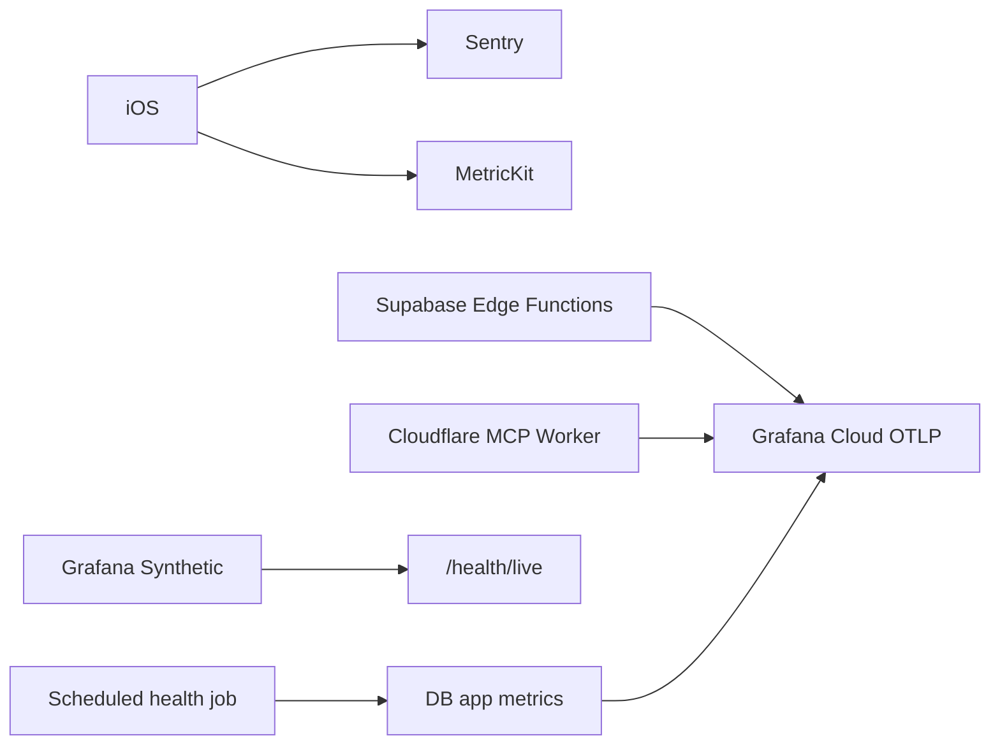

# 관찰 가능성·모니터링·알림

> 스택: [기술 스택 기준선](./22-technology-stack-baseline.md)  
> 데이터 파이프라인: [데이터 파이프라인](./17-data-pipeline.md)  
> 개인정보: [개인정보·동의·AI 정책](./06-privacy-consent-ai-policy.md)

## 1. 선택

```text
Backend metrics/logs/traces: Grafana Cloud Free
iOS crashes/performance: Sentry Developer Free
Supabase platform logs: Supabase Dashboard
Apple production diagnostics: MetricKit
Uptime: Grafana Synthetic Monitoring
```

Prometheus와 Grafana 서버를 직접 배포하지 않는다. Grafana Cloud의 Prometheus 호환 metrics, Loki, Tempo를 사용한다.

## 2. 전송 구조



서버리스 환경에서는 Grafana Alloy를 별도 운영하지 않고 OTLP/HTTP로 직접 전송한다. 유실 없는 telemetry가 필요할 정도로 규모가 커지면 collector를 추가한다.

## 3. 서비스 이름

```text
myday-api
myday-jobs
myday-mcp
myday-approval-web
myday-ios
```

공통 resource attributes:

```text
service.name
service.version
deployment.environment
request.id
```

user ID, Todo 제목, 이메일을 metric label에 넣지 않는다.

## 4. RED metrics

모든 HTTP 서비스:

```text
http_server_requests_total
http_server_errors_total
http_server_duration_ms
```

label:

```text
service
environment
route_template
method
status_class
```

실제 URL, proposal ID, Todo ID를 label로 사용하지 않는다.

## 5. 도메인 metrics

```text
myday_sync_mutations_total
myday_sync_conflicts_total
myday_job_pending_count
myday_job_oldest_pending_seconds
myday_job_failures_total
myday_google_sync_failures_total
myday_google_sync_token_resets_total
myday_agent_runs_total
myday_agent_failures_total
myday_agent_duration_ms
myday_proposals_created_total
myday_proposals_approved_total
myday_notification_failures_total
myday_backup_age_seconds
```

AI 비용:

```text
myday_openai_input_tokens_total
myday_openai_output_tokens_total
myday_openai_requests_total
```

사용자 ID별 metric은 만들지 않는다.

## 6. 로그

JSON 구조:

```text
timestamp
level
service
environment
event_name
request_id
job_id?
agent_run_id?
provider_request_id?
duration_ms?
error_code?
```

로그 금지:

- Todo 제목·메모
- 검색어
- AI 입력·출력 원문
- OAuth token
- device token
- authorization header
- 이메일

## 7. traces

span:

```text
HTTP request
DB query category
domain command
external API
job processing
```

DB SQL 원문과 bind parameter는 전송하지 않는다. 외부 API span에는 공급자, operation, status, duration만 둔다.

기본 sampling:

```text
성공 요청 10%
오류 요청 100%
Agent 요청 100%
```

50명 파일럿에서 무료 한도를 넘으면 성공 sampling부터 낮춘다.

## 8. iOS

Sentry:

- crash
- handled error
- 앱 시작 지연
- network breadcrumb에서 URL path template만

MetricKit:

- hang
- crash diagnostic
- CPU
- memory
- launch time

사용자 메시지와 일정 내용을 Sentry context에 첨부하지 않는다.

## 9. health endpoints

```text
GET /health/live
GET /health/ready
```

`live`:

- 프로세스 응답 여부
- 외부 API 호출 없음

`ready`:

- 필수 설정 존재
- 짧은 DB `select 1`
- OpenAI·Google은 확인하지 않음

응답은 민감 설정을 포함하지 않는다.

## 10. dashboards

### API

- request rate
- error rate
- p50/p95/p99
- route별 지연

### Pipeline

- pending jobs
- oldest pending
- retry와 permanent failure
- Google sync 상태

### AI

- 요청·실패
- 지연
- 도구 호출 수
- token
- proposal 승인률

### Mobile

- crash-free sessions
- launch
- hang
- API error

### Cost

- Supabase DB·egress 사용률
- Grafana ingestion
- Cloudflare Workers requests
- R2 storage
- OpenAI token 추정 비용

## 11. alerts

| 조건 | 심각도 | 전달 |
|---|---|---|
| 5분 error rate > 5% | warning | 이메일 |
| 5분 error rate > 20% | critical | 이메일·즉시 확인 |
| p95 > 2초 10분 | warning | 이메일 |
| oldest pending job > 5분 | warning | 이메일 |
| Google sync failure 3회 | warning | 이메일 |
| backup age > 36시간 | critical | 이메일 |
| health check 3회 연속 실패 | critical | 이메일 |
| OpenAI 일 예산 80% | warning | 이메일 |
| OpenAI 일 예산 100% | critical | AI 호출 차단 |

초기에는 PagerDuty를 추가하지 않는다.

## 12. 보존

- Grafana Free 한도 내 기본 보존
- Supabase Free 로그는 1일
- Sentry 원문 개인정보 미전송
- 자체 감사 로그는 DB 보존 정책

telemetry는 제품 데이터의 백업이 아니다.

## 13. 장애 대응

```text
alert
→ dashboard
→ request/job/provider ID로 trace
→ Supabase 또는 Cloudflare 상태 확인
→ 기능 degrade
→ 복구
→ 24시간 내 짧은 incident note
```

degrade 예:

- OpenAI 장애: 직접 일정 기능 유지
- Google 장애: 마지막 sync 데이터와 stale 표시
- Grafana 장애: 제품 기능 유지
- Cloudflare 승인 웹 장애: 앱 내 승인 유지

